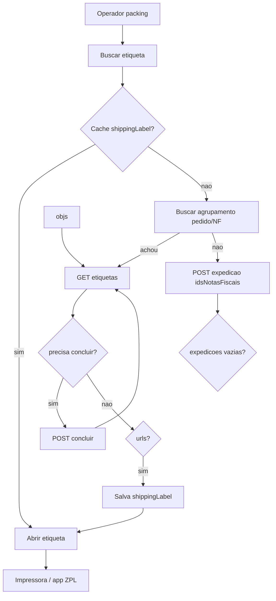

# Contexto mestre: etiquetas Tiny / packing WMS

**Atualizado em:** 2026-08-18  
**Audiência:** pessoa ou IA que precisa retomar o trabalho sem reler o chat inteiro.

Este é o **documento de entrada**. Os outros `docs/tiny-*` e specs são anexos (JSONs brutos, Postman, casos antigos).

### Índice rápido dos docs relacionados

| Doc | Quando usar |
|-----|-------------|
| **Este arquivo** | Visão completa atual |
| [[etiquetas-expedicao-tiny]] | Conceitos (marketplace vs Correios, diagnóstico jun/2026) |
| [[tiny-status-etiqueta-2026-08-17]] | Resumo da validação 17–18/08 |
| [[contexto-etiqueta-tiny-214617]] | Caso antigo CARBI / Correios |
| [[superpowers/specs/2026-08-05-tiny-etiqueta-geracao-design]] | Design packing + adendo |
| [[superpowers/plans/2026-08-05-tiny-etiqueta-geracao]] | Plano de implementação (com adendo) |
| [[postman/README]] / [[postman/README-busca-nf]] | Como testar na API |
| [[handoff-desenvolvimento-jun-2026]] | Histórico jun/2026 |
| [[README]] | Mapa geral da documentação |

---

## 1. Objetivo do produto

No packing (`/packing/[orderId]`), o operador clica **Buscar etiqueta** → o WMS obtém URL ZPL/PDF da Tiny → **Abrir / imprimir** na caixa.

- **DANFE** (`GET /notas/{id}/link`) ≠ etiqueta de transporte.
- Não existe `GET /pedidos/{id}/etiquetas` (404).

---

## 2. Contas e ambiente

| Item | Valor |
|------|--------|
| Tenant | Default (`cmsj10hmw0000wh98leeb2iu3`) |
| Conta Tiny foco | **MEU PUXADOR** — connection `cmst909h50epkl0016ytukm52` (default, CONNECTED) |
| Conta antiga de teste | CARBI (Correios / pedido tela 214617) — ver [[contexto-etiqueta-tiny-214617]] |
| API | `https://api.tiny.com.br/public-api/v3` |
| OAuth | `https://accounts.tiny.com.br/realms/tiny/protocol/openid-connect/token` |
| Docs oficiais | https://api-docs.erp.olist.com (seção Expedição) |

Forma de envio que **gera ZPL** nestes testes: **Jadlog via Melhor Envio Vnda** (`851418498`), frete `.Com` (`851418500`), gateway Melhor Envio Vnda `851418485`.

Mercado Envios: cria/conclui lote, mas GET etiquetas → *“Forma de envio não possui recurso de etiquetas”*.

---

## 3. Pedido de prova (etiqueta OK)

| Campo | Valor |
|-------|--------|
| Ecommerce | `40A0133E85` |
| nº pedido Tiny | `238392` |
| `idPedido` | `862886936` |
| `erpOrderId` WMS | `TINY-862886936` |
| WMS order id | `cmstcnrt70162whrkor3aux3a` |
| Cliente | Rafael Garcia |
| NF nº | **171579** |
| `idNotaFiscal` | `862886988` |
| **idAgrupamento** | **`746538070`** (identificação `8965`, data **2026-08-17**) |
| idExpedição (dentro do lote) | `750138952` |
| ZPL local | `docs/tiny-etiqueta-171579.zpl` |

### IDs que confundem

| Id | O que é | Onde usar |
|-----|---------|-----------|
| `746538070` | **Agrupamento** (aparece em `GET /expedicao`) | `GET /expedicao/746538070` |
| `750138952` | Expedição **dentro** do lote | `GET /expedicao/746538070/expedicao/750138952/etiquetas` |
| `862886988` | id interno da NF | create / match |
| `171579` | Número da NF na etiqueta impressa | impressão / UI Tiny |

`GET /expedicao/750138952` **não funciona** — a listagem só conhece o agrupamento.

---

## 4. Conceitos Tiny (não confundir)

```
Pedido (venda)
    └── pode ter NF
            └── pode entrar em AGRUPAMENTO de expedição (lote)
                    └── expedicoes[] (um objeto por NF/pedido)
                            └── etiquetas → urls[] (ZPL na S3)
```

| Conceito | Significado |
|----------|-------------|
| Agrupamento | Lote (`id` na listagem); tem `identificacao`, `formaEnvio`, `expedicoes[]` |
| Expedição (item) | Um objeto dentro do lote (`notaFiscal`, `venda`, `volume`, `logistica`) |
| Concluir | Fecha o lote; Tiny pode chamar Melhor Envio (“lista de postagem” / checkout) |
| `quantidadeObjetos` na lista | **Não é confiável** (pode ser 0 com objetos no detalhe) |

---

## 5. Fluxo API Tiny (validado)

Base: Bearer OAuth da connection Tiny do tenant.

### Caminho feliz (etiqueta nova)

1. `POST /expedicao` body `{ "idsNotasFiscais": [idNota] }` → `{ "id": idAgrupamento }`
2. `GET /expedicao/{id}` → `expedicoes[]` **não vazio**
3. Se `GET .../etiquetas` → 400 *“Agrupamento ainda não foi concluído”* → `POST .../concluir`
4. `GET /expedicao/{id}/etiquetas` → `{ "urls": ["https://s3...zpl"] }`

Preferir **NF**. `idsPedidos` com NF já expedida costuma criar lote **vazio** (`expedicoes: []`).

### Caminho feliz (etiqueta já existe)

1. Listar: `GET /expedicao?orderBy=desc&dataInicial=…&dataFinal=…&idFormaEnvio=851418498`  
   (incluir **até a data de hoje** — o lote da NF 171579 é 17/08, não 14/08)
2. Para cada `id`: `GET /expedicao/{id}` e procurar `notaFiscal.id` / `venda.id`
3. `GET .../etiquetas` (lote ou individual)

A listagem **não** filtra por NF/pedido. Só: `idFormaEnvio`, `dataInicial`, `dataFinal`, `limit`, `offset`, `orderBy`.

### Erros reais vistos

| Situação | HTTP / mensagem |
|---------|-----------------|
| GET etiquetas antes de concluir (lote novo) | 400 *Agrupamento ainda não foi concluído* |
| Lote vazio + concluir | 400 *Nenhuma expedição…* / checkout sem etiqueta |
| Create com NF já expedida | 400 *Nota fiscal … já foi expedida* |
| Create só pedido (NF já expedida) | 200 + `expedicoes: []` |
| Concluir Jadlog novo (ME) | 400 *Não foi possível enviar a lista de postagem* ou erro de checkout |
| Mercado Envios após concluir | 400 *Forma de envio não possui recurso de etiquetas* |

---

## 6. Como o WMS funciona hoje

### UI

Arquivo: `apps/web/app/(dashboard)/packing/[orderId]/page.tsx`

| Controle | Ação |
|----------|------|
| **Buscar etiqueta** | `POST /api/packing/orders/:id/shipping-labels` |
| **Atualizar** | mesmo POST com `?refresh=1` |
| **Abrir etiqueta** | `target=_blank` na URL (imprimir = abrir ZPL) |

Não há botão “Imprimir” separado. Finalizar packing **não** depende da etiqueta.

### API

| Item | Detalhe |
|-------|---------|
| Rota | `POST /api/packing/orders/:id/shipping-labels` |
| Permissão | `SHIPPING_VIEW` |
| Serviço | `fetchShippingLabelsForOrder` em `apps/api/src/services/tiny-shipping-labels.ts` |
| Helpers GET | `apps/api/src/services/tiny-expedicao-labels.ts` |
| Cache | 1ª URL em `Order.shippingLabel` |

### Status de resposta (body 200)

| status | Significado |
|--------|------------|
| `OK` | `urls[]` preenchido |
| `NOT_TINY_ORDER` | `erpOrderId` não é `TINY-{id}` |
| `NOT_IN_EXPEDICAO` | Pedido não achado no índice de agrupamentos |
| `NO_URLS` / `MARKETPLACE_ERROR` / `API_ERROR` | Ver mensagem |

### Lacuna atual do código

Só **consulta** (GET listagem + detalhe + etiquetas). **Não** implementa:

- `POST /expedicao` (criar)
- `POST .../concluir`
- Preferência por `idsNotasFiscais`
- Janela de datas até “hoje” (bug que atrasou achar `746538070`)

Design antigo: `docs/superpowers/specs/2026-08-05-tiny-etiqueta-geracao-design.md` (create no botão; **concluir** estava fora de escopo — testes posteriores mostram que concluir é necessário em vários casos).

Packing só inicia se status = **`PICKED_AWAITING_CONFERENCE`** (`startPacking` em `order-packing.ts`). Pedido de prova pode estar `PAUSED_ISSUE` → não entra na fila.

---

## 7. Fluxo desejado no sistema (até imprimir)



---

## 8. Teste tela a tela (WMS)

Pedido: `40A0133E85` / `TINY-862886936` / id `cmstcnrt70162whrkor3aux3a`.

| # | Tela | Ação | Esperado |
|---|------|------|----------|
| 1 | `/login` | Login com packing | OK |
| 2 | `/packing` | Abrir pedido | Só se `PICKED_AWAITING_CONFERENCE` |
| 3 | `/packing/{id}` | Painel **Etiqueta de envio** | Botão Buscar |
| 4 | Mesma | **Buscar etiqueta** | Após fix: URL; hoje pode `NOT_IN_EXPEDICAO` |
| 5 | Mesma | **Abrir etiqueta** | ZPL NF 171579 |
| 6 | Opcional | Finalizar packing | Independente da etiqueta |

Se status ≠ packing: `/pedidos` para achar → ajustar status / refazer picking → voltar ao passo 2.

### Postman (prova sem UI)

1. Importar `docs/postman/Tiny-Busca-NF-Expedicao.pronto.postman_collection.json` (ou collection + `.local`)
2. `GET /expedicao/746538070`
3. `GET /expedicao/746538070/etiquetas`
4. Abrir `urls[0]`

Guia: `docs/postman/README-busca-nf.md`

---

## 9. Casos históricos (não misturar)

### MEU PUXADOR — `40A0133E85` (atual)

Etiqueta **existe** no lote `746538070`. Create de novo com a mesma NF → “já foi expedida” (esperado).

### CARBI — tela 214617 / NF 005554

| Campo | Valor |
|-------|--------|
| Pedido API | `861203611` → `TINY-861203611` |
| NF | `861203622` |
| Forma | Correios `743997871` (`formasFrete: []`) |
| Confusão | `TINY-860803335` = pedido **211641**, não 214617 |

Detalhe: [[contexto-etiqueta-tiny-214617]]

### Lote amostra ZPL (outras NFs)

`746537716` (ident. 8901) — 4 NFs Jadlog; ZPL em `docs/tiny-etiqueta-sample.zpl`. **Não** é a NF 171579.

---

## 10. Mapa de arquivos

### Código WMS

| Arquivo | Papel |
|---------|--------|
| `apps/web/app/(dashboard)/packing/[orderId]/page.tsx` | UI Buscar / Abrir |
| `apps/api/src/routes/web.ts` | `POST .../shipping-labels` |
| `apps/api/src/services/tiny-shipping-labels.ts` | Orquestra cache + busca |
| `apps/api/src/services/tiny-expedicao-labels.ts` | GET expedição / etiquetas |
| `apps/api/src/services/tiny-api-v3-client.ts` | OAuth + HTTP Tiny |
| `apps/api/scripts/lib/tiny-expedicao-search.ts` | Busca por pedido (scripts) |
| `apps/api/scripts/teste-fluxo-etiqueta-completo.ts` | Script create → concluir |

### Docs / evidências

| Arquivo | Conteúdo |
|---------|---------|
| **Este arquivo** | Contexto mestre |
| `docs/etiquetas-expedicao-tiny.md` | Guia conceitual (marketplace vs Correios) |
| `docs/tiny-status-etiqueta-2026-08-17.md` | Status do dia 17/08 (parcialmente desatualizado — ver §3 aqui) |
| `docs/contexto-etiqueta-tiny-214617.md` | Caso CARBI 214617 |
| `docs/superpowers/specs/2026-08-05-tiny-etiqueta-geracao-design.md` | Design generate-on-Buscar |
| `docs/tiny-pedido-862886936.json` | Dump pedido |
| `docs/tiny-fluxo-etiqueta-862886936-resultado.json` | Etapas create (lote vazio na época) |
| `docs/tiny-validacao-expedicao-862886936.json` | Contrato + erros |
| `docs/postman/Tiny-Busca-NF-Expedicao*.json` | Collection Postman |
| `docs/tiny-etiqueta-171579.zpl` | ZPL da NF de prova |
| `docs/tiny-etiqueta-sample.zpl` | ZPL amostra lote 8901 |

`.local` / `.pronto` Postman têm tokens — **não commitar** secrets (gitignore já cobre `.local` e `.pronto`).

---

## 11. O que implementar a seguir (checklist)

1. **Busca** — janela de datas até hoje + match por `notaFiscal.id` e `venda.id`
2. **Create** — se não achar: `idsNotasFiscais` (via `GET /pedidos/{id}` → `idNotaFiscal`)
3. **Concluir** — se GET etiquetas disser “não concluído”
4. **UI** — mensagens claras; link “Abrir / imprimir”; não bloquear complete
5. **Teste** — packing com `TINY-862886936` → Abrir = mesma ZPL do Postman
6. **Create do zero** — precisa NF Jadlog **ainda não expedida** (operacional Tiny)

---

## 12. Frases para não errar de novo

1. Listagem **não** mostra NF — sempre abrir o **detalhe**.
2. **Agrupamento** ≠ **idExpedição** interno.
3. “Já foi expedida” ≠ “não existe lote” — pode existir com outra **data**.
4. DANFE ≠ etiqueta.
5. WMS hoje só **busca**; gerar/concluir ainda é trabalho de implementação + estado Tiny/Melhor Envio.
