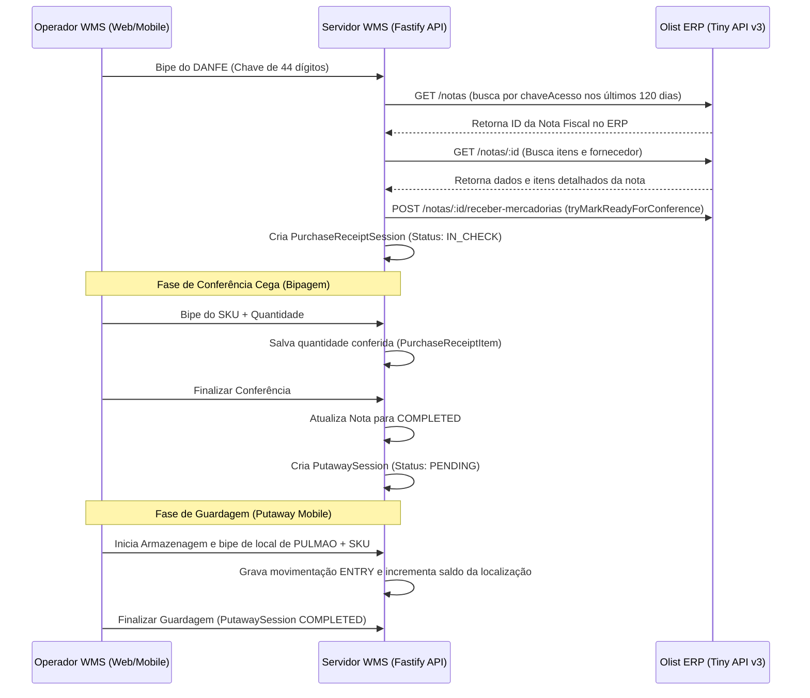

# 🚚 Fluxo de Recebimento de Compras (Inbound) e Guardagem (Putaway)

Este guia descreve os fluxos operacionais e técnicos de recebimento de Notas Fiscais de Entrada e armazenagem física dos itens nos locais de pulmão.

---

## 🔁 Fluxo Geral (Visão Macro)

O processo de recebimento inicia no descarregamento do caminhão e termina com o produto guardado de forma organizada nas posições de pulmão:

---

## 🧾 Fase 1: Recebimento e Conferência (`PurchaseReceiptSession`)

O recebimento é realizado no painel web ou através do fluxo mobile de entrada bipando o documento fiscal.

### 1. Início da Sessão (Leitura do DANFE)
1.  O expedidor faz a leitura do código de barras da chave de acesso impresso no DANFE.
2.  A API executa a função `parseNfeAccessKeyFromBarcode` para extrair os 44 dígitos da chave de acesso da NF-e.
3.  O WMS busca nos últimos 120 dias da API do Tiny (`findEntryInvoiceByAccessKey`) para localizar a nota fiscal correspondente.
4.  Se encontrada, o WMS puxa o cabeçalho e os itens do ERP e cria um registro `PurchaseReceiptSession` local com status `IN_CHECK`.
5.  O WMS tenta sinalizar o Tiny ERP chamando `tryMarkReadyForConference`. Esta etapa avisa ao ERP que o recebimento físico do WMS está em andamento.

### 2. Conferência Física das Mercadorias
1.  Os produtos são contados e biados um a um.
2.  Para cada bipe do código de barras do produto, o endpoint `scanPurchaseReceiptItem` valida se o SKU/EAN faz parte da nota fiscal.
3.  Se pertencer, o WMS incrementa a quantidade conferida (`quantityChecked`) no registro do `PurchaseReceiptItem`.
4.  O sistema exibe o progresso em tempo real (ex: `Conferido: 5 / Esperado: 10`).

### 3. Conclusão da Conferência
1.  O usuário clica em "Finalizar Conferência".
2.  O sistema roda a validação `completePurchaseReceipt` para garantir que a quantidade contada confere com a esperada (caso haja divergência, o sistema gera status de `ISSUE` para correção manual).
3.  Se tudo estiver correto, o status da nota muda para `COMPLETED`.
4.  No mesmo instante da conclusão, uma transação do Prisma cria automaticamente uma sessão de armazenagem (`PutawaySession`) associada, contendo os itens prontos para serem guardados.

---

## 📥 Fase 2: Guardagem de Mercadorias (`PutawaySession`)

O processo de **Putaway** (Armazenagem) é executado exclusivamente no mobile pelo operador reabastecedor/guardador.

### 1. Fila de Armazenagem
1.  O operador mobile visualiza a lista de sessões de armazenagem pendentes no menu **Armazenagem** (`listPutawayQueue`).
2.  Ao aceitar a tarefa, o status da `PutawaySession` passa para `IN_PROGRESS` e a tarefa é atribuída ao operador.
3.  O aplicativo exibe a fila otimizada de rota de pulmões para guardar os produtos, de modo a minimizar o deslocamento do operador no galpão.

### 2. Execução da Guardagem (Pulmão)
1.  O operador se desloca até o local sugerido e realiza as bipagens de validação:
    *   **Bipe 1**: Código de barras da localização (a localização **precisa** ser do tipo `PULMAO`).
    *   **Bipe 2**: Código de barras do produto.
    *   **Quantidade**: Informa a quantidade física que está sendo guardada.
2.  O sistema executa `storePutawayItem` que realiza as seguintes ações em uma única transação no banco de dados:
    *   Incrementa a quantidade guardada (`quantityStored`) no item da guardagem.
    *   Incrementa o saldo físico da localização do pulmão (`currentQuantity` na tabela `Location`) e aloca o `productId` ao endereço se estivesse vazio.
    *   Grava um registro histórico de movimentação do tipo **`ENTRY`** na tabela `InventoryMovement`.

### 3. Finalização
1.  Assim que todos os itens forem devidamente posicionados nos pulmões correspondentes, o operador finaliza a sessão.
2.  O status da `PutawaySession` é atualizado para `COMPLETED` e os logs de cronometragem são encerrados.

Para informações sobre como configurar a integração com o ERP que viabiliza o recebimento de compras, consulte o guia [[integracao-tiny-oauth|Integração Tiny ERP]].
