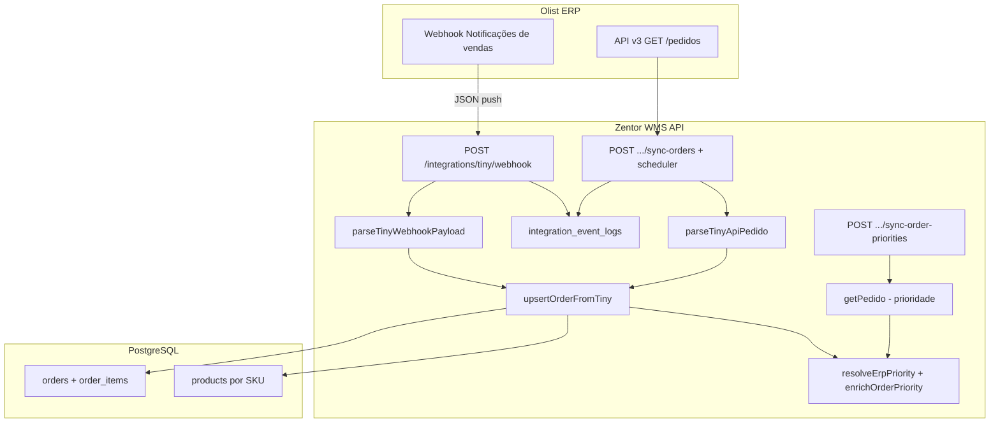

# Integração Tiny/Olist — Pedidos de venda

Referência técnica para receber **pedidos de venda** do Olist ERP (Tiny) no Zentor WMS: webhooks, **sync pull** (`GET /pedidos`), mapeamento para `Order`, diagnóstico e ajustes de integração (jun/2026).

Documentos relacionados:

- [[integracao-tiny-oauth|OAuth e conexão da conta]]
- [[tiny-conexao-conta-ajustes|Histórico de ajustes na conexão OAuth]]
- [[logica-ondas|Ondas e priorização de pedidos]]
- [[contexto-etiqueta-packing-tiny|Etiquetas de transporte no packing]]

---

## Objetivo no WMS

Quando um pedido de venda é criado ou alterado no Tiny/Olist, o WMS deve:

1. **Ingerir** o pedido no tenant correto (`Order` + `OrderItem`).
2. **Resolver** SKUs para produtos cadastrados no WMS.
3. **Calcular prioridade** (Tiny + marketplace + deadline) para ondas e packing.
4. **Registrar auditoria** em `integration_event_logs`.
5. Manter o pedido em `PENDING` até liberação de onda / operação.

Não usamos API v2 (`api.tiny.com.br/api2` + `token=`). Tudo é **API v3** + **OAuth Bearer**.

---

## Pré-requisitos

| Item | Onde |
|------|------|
| Conta Olist conectada (OAuth) | `/integracoes/tiny` — ver [[integracao-tiny-oauth]] |
| `ENCRYPTION_KEY` fixa | `apps/api/.env` |
| Produtos no WMS com **SKU igual** ao `produto.sku` / `codigo` do Tiny | Cadastros → Produtos |
| App **Webhooks** instalado no ERP Olist | Loja de aplicativos + Configurações → Webhooks |
| Permissão no aplicativo OAuth | Leitura (e gravação se for atualizar status no futuro) em **Pedidos de Venda** |

Base URL da API v3 (documentação MCP / OpenAPI):

```
https://api.tiny.com.br/public-api/v3
```

Autenticação: `Authorization: Bearer {access_token}` (token obtido via OAuth — já gerenciado por `TinyApiV3Client`).

---

## Conferência MCP — como o Olist envia pedidos

Fonte: MCP **Olist ERP API v3** (`search_olist_erp_api_v3`, `query_docs_filesystem_olist_erp_api_v3`) e OpenAPI publicado em https://api-docs.erp.olist.com.

### Canal 1 — Webhook (recomendado, tempo real)

Documentação: [Webhooks](https://api-docs.erp.olist.com/documentacao/webhooks/webhooks).

| Tipo no painel Olist | Quando dispara | Uso no WMS |
|----------------------|----------------|------------|
| **Notificações de vendas** | Pedido de Venda **criado ou alterado** | **Principal** — criar/atualizar `Order` |
| Notificações de pedidos enviados | Pedido vai para situação **enviado** | Futuro — marcar expedido / encerrar fluxo |
| Notificações de lançamentos de estoque | Estoque de produto alterado | Fora do escopo de pedidos |
| Notificações de NF autorizadas | NF autorizada | Escopo de NF entrada / faturamento |

Regras do ERP:

- A URL configurada deve responder **HTTP 200** para confirmar recebimento.
- Se não confirmar, o Olist reenvia até **10 vezes**, com atraso progressivo (+5 min por tentativa).
- **Não é possível** criar webhook por aplicativo OAuth; é configuração **por conta ERP** (extensão Webhooks).

Cadastro no ERP:

1. Instalar aplicativo **Webhooks** (planos específicos).
2. Menu → Configurações → Geral → Outras configurações → **Webhooks**.
3. Ativar **Notificações de vendas** e informar a URL do WMS (ver seção [Configuração no WMS](#configuração-no-wms)).

O payload exato do webhook **não está detalhado campo a campo** na documentação v3 pública; na prática o Tiny envia JSON com estrutura legada (`dados.pedido`, `itens`, etc.). O WMS já trata variações em `parseTinyWebhookPayload` (ver [Mapeamento webhook → WMS](#mapeamento-webhook--wms)).

### Canal 2 — API v3 (consulta / complemento)

| Método | Endpoint | Uso |
|--------|----------|-----|
| `GET` | `/pedidos` | Listar pedidos (filtros: data, situação, e-commerce, `origemPedido`, paginação) |
| `GET` | `/pedidos/{idPedido}` | Detalhe completo: itens, cliente, e-commerce, transportador, situação |

Referências MCP:

- [Listar pedidos](https://api-docs.erp.olist.com/api-reference/pedidos/listar-pedidos)
- [Obter pedido](https://api-docs.erp.olist.com/api-reference/pedidos/obter-pedido)

**Situações do pedido** (`situacao`, enum numérico):

| Código | Significado |
|--------|-------------|
| 8 | Dados incompletos |
| 0 | Aberta |
| 3 | Aprovada |
| 4 | Preparando envio |
| 1 | Faturada |
| 7 | Pronto envio |
| 5 | Enviada |
| 6 | Entregue |
| 2 | Cancelada |
| 9 | Não entregue |

**Filtros úteis em `GET /pedidos`:**

- `dataInicial` / `dataFinal` — criação
- `dataAtualizacao` — alterações (backfill incremental)
- `situacao` — ex.: só aprovados/prontos para envio
- `origemPedido` — no **corpo** da resposta: `0` = pedido de venda, `1` = PDV
- `numeroPedidoEcommerce` — pedido no marketplace
- `limit` / `offset` — paginação (padrão limit 100)

**Atenção — filtro `origemPedido` na query (comportamento observado jun/2026):**

Enviar `origemPedido=0` **explicitamente** em `GET /pedidos` pode retornar **lista vazia** (`total: 0`), mesmo existindo pedidos de venda com `origemPedido: 0` no JSON. O WMS **não envia** esse parâmetro no sync pull — apenas `dataInicial`, `dataFinal`, paginação e `orderBy`. Para testar no Postman, omita `origemPedido` ou compare com/sem o parâmetro.

**Número na tela vs. ID na API:**

| No ERP (grade) | Na API / WMS |
|----------------|--------------|
| Coluna **Nº** / `numeroPedido` (ex.: `1`) | Não usar em `GET /pedidos/{id}` |
| — | Campo **`id`** (ex.: `345909608`) → `erpOrderId` = `TINY-345909608` |

**Modelo de item em `GET /pedidos/{id}`** (`ItemPedidoResponseModel`):

- `produto.sku` — SKU principal para o WMS
- `produto.descricao`
- `quantidade`
- `valorUnitario`

**E-commerce** (`ecommerce`):

- `nome`, `canalVenda`, `numeroPedidoEcommerce`, `numeroPedidoCanalVenda`

### Canal 3 — API v2 (não usar)

Existem webhooks e serviços na documentação **api-v2** (ex.: “atualização situação pedido”). O WMS **não** integra por v2. Manter apenas v3 + webhooks genéricos de vendas.

---

## Arquitetura no Zentor WMS



### Arquivos do código (pedidos)

| Arquivo | Responsabilidade |
|---------|------------------|
| `apps/api/src/routes/integrations.ts` | Rota pública do webhook |
| `apps/api/src/services/tiny-integration.ts` | Parse webhook/API, upsert, situações sync, `parseTinyApiPedido` |
| `apps/api/src/services/sync-sales-orders-from-tiny.ts` | Sync pull `GET /pedidos` + upsert |
| `apps/api/src/services/tiny-order-sync-scheduler.ts` | Job diário (~07:00 SP) por tenant conectado |
| `apps/api/src/services/tiny-order-priority.ts` | Prioridade Tiny + `GET /pedidos/{id}` |
| `apps/api/src/services/marketplace-priority.ts` | Marketplace + score WMS |
| `apps/api/src/services/tiny-api-v3-client.ts` | `listPedidos`, `getPedido` (sem default `origemPedido=0`) |
| `apps/api/src/routes/tiny.ts` | `sync-orders`, `sync-order-priorities`, OAuth |
| `apps/api/src/routes/web.ts` | `GET /api/integrations/tiny/events` (auditoria UI) |
| `apps/web/app/(dashboard)/integracoes/tiny/page.tsx` | Webhook, eventos, **Reexecutar sync manual** |

---

## Configuração no WMS

### URL do webhook

Exposta na tela `/integracoes/tiny`:

```
{API_PUBLIC_URL}/integrations/tiny/webhook
```

Exemplo local:

```
http://localhost:3333/integrations/tiny/webhook
```

**Multi-tenant:** a rota resolve o tenant por:

1. Query `?tenant={slug}` — ex.: `?tenant=default`
2. Header `x-tenant-slug: default`
3. Se omitidos: **primeiro tenant ativo** do banco (comportamento atual em dev com um só tenant)

Recomendação produção:

```
https://api.seudominio.com/integrations/tiny/webhook?tenant=slug-do-cliente
```

### Token de validação (opcional)

Chave em `system_settings`: `tiny.webhook.secret`.

Configurável em **Admin → Configurações** (`apps/web/app/(dashboard)/admin/configuracoes/page.tsx`).

O ERP deve enviar o token em:

- Header `x-tiny-token`, ou
- Header `Authorization: Bearer {token}`

Se o secret estiver vazio no WMS, a rota **não exige** token (útil só em dev).

### Cadastro de produtos

Cada linha do pedido Tiny precisa de um `Product` ativo com o mesmo **SKU**:

- Webhook: `codigo`, `sku`, `codigo_produto` ou `id_produto` (primeiro encontrado).
- API v3: `itens[].produto.sku`.

Se nenhum SKU bater, o webhook retorna **422** com mensagem `Nenhum SKU do pedido TINY-{id} encontrado no cadastro`.

---

## Fluxo webhook (implementado)

### Sequência

1. Olist dispara `POST` na URL do WMS com JSON do pedido.
2. `resolveWebhookTenantId` identifica o `tenantId`.
3. Valida token (se `tiny.webhook.secret` configurado).
4. `parseTinyWebhookPayload(body)` → `TinyOrderPayload` ou `null`.
5. Se `null` → log `IGNORED`, resposta `{ ok: true, ignored: true }`.
6. Se válido → `upsertOrderFromTiny(tenantId, payload)`.
7. Log `OK` ou `ERROR` em `integration_event_logs`.
8. Resposta HTTP 200 em sucesso (obrigatório para o ERP parar reenvios).

### Regras de upsert (`upsertOrderFromTiny`)

| Regra | Comportamento |
|-------|----------------|
| Chave | `tenantId` + `erpOrderId` (único) — formato `TINY-{id}` |
| Pedido novo | `status = PENDING`, `erpSource = TINY` |
| Pedido existente em `PENDING` ou `PAUSED_ISSUE` | Atualiza itens, cliente, marketplace, deadline, prioridade |
| Pedido já em separação/packing/expedido | **Não altera** — retorna `created: false` |
| Itens | Recria `order_items` apenas em atualização permitida |
| Prioridade | Webhook → campos `prioridade*`; senão `GET /pedidos/{id}`; depois `enrichOrderPriority` (marketplace) |

---

## Mapeamento webhook → WMS

Função: `parseTinyWebhookPayload` em `tiny-integration.ts`.

### Identificação do pedido

| Origem no JSON (ordem de tentativa) | Campo WMS |
|-------------------------------------|-----------|
| `dados.pedido.id`, `id_pedido`, `numero`, `numero_ecommerce`, `root.id` | `erpOrderId` = `TINY-{valor}` |

### Cabeçalho

| Origem Tiny (exemplos) | Campo `Order` |
|------------------------|---------------|
| `nome_cliente`, `cliente`, `nome` | `customerName` |
| `ecommerce`, `nome_ecommerce`, `loja` + heurística ML/Shopee/… | `marketplace` |
| `data_coleta`, `prazo_coleta`, `collection_deadline` | `collectionDeadline` |
| `prioridade`, `nivel_prioridade`, … | `erpPriority` (via normalização 0–100) |

### Itens

| Origem Tiny | Campo WMS |
|-------------|-----------|
| `itens[]`, `items[]`, `produtos[]` | Lista de linhas |
| `item.codigo` / `sku` / `codigo_produto` | Match `Product.sku` |
| `quantidade` / `qty` | `quantityOrdered` |

### Payload de exemplo (ilustrativo)

Estruturas reais variam; o parser aceita nesting em `dados`, `pedido`, `order`, `venda`:

```json
{
  "dados": {
    "pedido": {
      "id": 12345,
      "nome_cliente": "Cliente Exemplo",
      "ecommerce": "Mercado Livre",
      "loja": "ML Loja A",
      "data_coleta": "2026-06-04T18:00:00.000Z",
      "prioridade": 4,
      "itens": [
        {
          "item": {
            "codigo": "PAR-6X40",
            "descricao": "Parafuso 6x40",
            "quantidade": 2
          }
        }
      ]
    }
  }
}
```

Resultado no WMS:

- `erpOrderId`: `TINY-12345`
- `marketplace`: `MERCADO_LIVRE` (se detectado)
- `erpPriority`: `80` (prioridade 4 na escala 1–5)
- 2 unidades do produto SKU `PAR-6X40`

---

## Mapeamento API v3 `GET /pedidos` / `GET /pedidos/{id}` → WMS

Função: `parseTinyApiPedido` em `tiny-integration.ts` (sync pull e detalhe após listagem).

| Campo API v3 | Campo WMS |
|--------------|-----------|
| `id` | `erpOrderId` → `TINY-{id}` |
| `itens[].produto.sku` | Match `Product.sku` → `order_items` |
| `itens[].quantidade` | `quantityOrdered` |
| `cliente.nome` | `customerName` |
| `ecommerce.nome`, `canalVenda` | `marketplace` |
| `dataPrevista`, `dataEntrega` | `collectionDeadline` |
| `situacao` | Filtro de ingestão (ver tabela abaixo) |

### Situações importadas no sync pull

Constante: `TINY_ORDER_SITUACOES_SYNC` = `{ 0, 1, 3, 4, 7 }`.

| Código | Significado | Sync pull |
|--------|-------------|-----------|
| 0 | Aberta | **Importa** |
| 3 | Aprovada | Importa |
| 4 | Preparando envio | Importa |
| 1 | Faturada | Importa |
| 7 | Pronto envio | Importa |
| 2 | Cancelada | Remove `Order` **PENDING** existente (`TINY-{id}`) |
| 5, 6, 8, 9 | Enviada, entregue, etc. | Ignorado (`skipped`) |

Também usado em `fetchTinyOrderPriority` quando o webhook não traz prioridade.

---

## Sync pull de pedidos (implementado)

Serviço: `syncSalesOrdersFromTiny` (`sync-sales-orders-from-tiny.ts`).

### Disparo

| Canal | Como |
|-------|------|
| UI | `/integracoes/tiny` → botão **Reexecutar sync manual** |
| API | `POST /api/integrations/tiny/sync-orders` — body opcional `{ "days": 30 }` (1–90) |
| Agendado | `tiny-order-sync-scheduler.ts` — ~**07:00** America/Sao_Paulo, tenants `CONNECTED` |

Permissão: `olist.configure` (mesma da tela Tiny).

### Fluxo

1. Valida OAuth (`getTinyApiClient`).
2. Na **primeira** sync do tenant: remove pedidos/ondas demo do tenant (backfill limpo).
3. Pagina `GET /pedidos` com `dataInicial` / `dataFinal` (**sem** `origemPedido` na query).
4. Para cada item listado: valida situação → `GET /pedidos/{id}` → `parseTinyApiPedido` → `upsertOrderFromTiny`.
5. Grava `tiny.orders.lastSyncAt` em `system_settings`.
6. Registra `integration_event_logs` (`eventType: sync_orders`).

### Resposta (`SyncTinySalesOrdersResult`)

| Campo | Significado |
|-------|-------------|
| `created` / `updated` / `skipped` | Resultado do upsert |
| `listedFromTiny` | Quantos pedidos a API listou no período (antes dos filtros WMS) |
| `errors[]` | Ex.: SKU não cadastrado (`erpOrderId`, `message`) |
| `warning` | API vazia, ou listou mas nada importou (situação/SKU) |
| `tinyConnected` | `false` se OAuth inválido |

A UI exibe `warning` e a contagem `listedFromTiny` após o sync manual.

### Erro comum: SKU

Se `listedFromTiny >= 1` e `errors` contém `Nenhum SKU do pedido TINY-{id} encontrado no cadastro`:

1. Cadastre em **Produtos** um item com **SKU idêntico** ao `produto.sku` do Tiny.
2. Rode o sync novamente.

Exemplo validado (conta teste): pedido `TINY-345909608`, cliente CLIENTE TESTE, SKU `SKUTESTE`.

---

## API interna do WMS (já exposta)

| Método | Rota | Auth | Descrição |
|--------|------|------|-----------|
| `POST` | `/integrations/tiny/webhook` | Token opcional | Entrada de pedidos (Olist → WMS) |
| `GET` | `/api/integrations/tiny/events` | `sales.view` | Últimos 50 logs Tiny na UI |
| `POST` | `/api/integrations/tiny/sync-orders` | `olist.configure` | Sync pull `GET /pedidos` (body `{ days?: number }`) |
| `POST` | `/api/integrations/tiny/sync-order-priorities` | `olist.configure` | Rebusca prioridade em pedidos `PENDING` via API (até 200) |

Após o webhook, o pedido aparece no fluxo normal:

- Listagem / ondas: rotas web `sales.view`
- Priorização: [[logica-ondas]]

---

## Priorização

1. **Tiny** — `extractTinyPriorityFromRecord` + `normalizeTinyPriority` (escalas 1–5, 1–10 ou 0–100).
2. **Fallback** — `GET /pedidos/{id}` se webhook sem prioridade.
3. **WMS** — `enrichOrderPriority` combina `erpPriority`, marketplace (ex.: Mercado Livre), `collectionDeadline` → `Order.priority`.

Endpoint manual: **Sincronizar prioridades** (`syncPendingOrderPrioritiesFromTiny`) — útil após conectar OAuth ou mudar regras de marketplace.

---

## Alterações recentes (jun/2026)

| Problema | Causa | Correção |
|----------|--------|----------|
| Sync manual 0/0/0 com pedido visível no ERP | Query `origemPedido=0` na listagem retorna vazio na API Tiny | `listPedidos` só envia `origemPedido` se explícito; sync não passa o filtro |
| Pedido **em aberto** não importava | `TINY_ORDER_SITUACOES_SYNC` sem código `0` | Incluída situação **0 (Aberta)** |
| Erro após listar 1 pedido | SKU Tiny sem produto no WMS | Cadastrar SKU igual; ver `errors[]` no resultado |
| `GET /pedidos/1` 404 | Nº da grade ≠ `id` da API | Usar `id` da listagem → `TINY-{id}` |

---

## O que já está pronto vs. roadmap

### Implementado

- [x] Webhook público com log e tratamento de erro
- [x] Parser flexível de payload de vendas (webhook)
- [x] Upsert de pedido + itens por SKU
- [x] Detecção de marketplace
- [x] Prioridade Tiny + enrich WMS
- [x] Sync manual de prioridades (`POST sync-order-priorities`)
- [x] **Sync pull** `GET /pedidos` — botão UI, `POST sync-orders`, job diário
- [x] `parseTinyApiPedido` + mesmas regras de upsert do webhook
- [x] Situações 0, 1, 3, 4, 7; cancelado (2) remove PENDING
- [x] UI: webhook, eventos, sync manual com `listedFromTiny` e `warning`
- [x] Cliente API `listPedidos` / `getPedido`

### Recomendado implementar em seguida

| Item | Motivo |
|------|--------|
| **Webhook “pedidos enviados”** | Atualizar status para expedido automaticamente |
| **URL webhook com `?tenant=`** na UI | Multi-tenant explícito |
| **Idempotência por hash de payload** | Evitar reprocessar webhook duplicado |
| **Atualizar status no Tiny** (opcional) | `PUT` situação quando WMS expedir — validar endpoints v3 |
| **Filtro configurável de situação** | Se negócio não quiser importar Aberta (0) em produção |

### Fora de escopo imediato

- API v2
- Webhook de estoque / preço (outros módulos)
- Criação de produtos automaticamente a partir do Tiny (hoje exige cadastro prévio)

---

## Diagnóstico

Use a UI **Integrações → Tiny** → **Reexecutar sync manual** e leia o resumo (`listedFromTiny`, `warning`, `errors`).

Para testar a API Tiny diretamente (Postman ou curl), use o Bearer do OAuth e `GET https://api.tiny.com.br/public-api/v3/pedidos` **sem** `origemPedido=0` na query. Detalhe: `GET /pedidos/{id}` com o `id` retornado na listagem.

Interpretação rápida do sync:

| Resultado | Significado |
|-----------|-------------|
| `listedFromTiny: 0` | API não listou pedidos (período, conta, permissão ou filtro errado) |
| `listedFromTiny: 1`, `created: 0`, `errors` com SKU | Pedido existe; falta produto no WMS |
| `created: 1` | Pedido importado (`TINY-{id}` em Pedidos) |

---

## Testes

### 1. Webhook manual (curl)

```bash
curl -X POST "http://localhost:3333/integrations/tiny/webhook?tenant=default" \
  -H "Content-Type: application/json" \
  -H "x-tiny-token: SEU_SECRET_SE_CONFIGURADO" \
  -d '{
    "dados": {
      "pedido": {
        "id": 99901,
        "nome_cliente": "Teste Webhook",
        "ecommerce": "Mercado Livre",
        "prioridade": 5,
        "itens": [
          { "item": { "codigo": "PAR-6X40", "quantidade": 1 } }
        ]
      }
    }
  }'
```

Resposta esperada: `{ "ok": true, "orderId": "...", "created": true }`.

### 2. Conferir na UI

- `/integracoes/tiny` → eventos com status `OK`
- Painel de pedidos → `erpOrderId` `TINY-99901`, status `PENDING`

### 3. Testes automatizados

```bash
pnpm --filter @wms/api test
```

Arquivos: `tiny-integration.test.ts`, `tiny-sales-order-sync.test.ts`, `tiny-oauth.test.ts`, `tiny-order-priority.test.ts`.

### 4. Sync pull (UI ou API)

1. Conectar OAuth em `/integracoes/tiny`.
2. Garantir SKUs dos itens em Cadastros → Produtos.
3. Criar pedido no Tiny (ex.: em aberto) com itens que tenham `produto.sku`.
4. **Reexecutar sync manual** ou `POST /api/integrations/tiny/sync-orders` com `{ "days": 30 }`.
5. Conferir `TINY-{id}` em Pedidos e log `sync_orders` em `/integracoes/tiny`.

### 5. Teste com webhook (conta real)

1. Configurar webhook no ERP com a URL do WMS (túnel ngrok/cloudflare se local).
2. Alterar pedido de venda no Tiny.
3. Verificar evento e pedido no WMS.

---

## Rate limit e resiliência

Chamadas à API v3 (ex.: `getPedido` no sync de prioridade) passam por `TinyApiV3Client`:

- Intervalo mínimo ~1,2 s entre requests por conexão
- Retry em HTTP 429 (até 3x)
- Conexão pode ficar `BLOCKED` temporariamente

Webhooks **não** consomem cota da mesma forma que polling em massa; priorizar webhook + pull pontual.

---

## Checklist de go-live (pedidos)

- [ ] OAuth conectado por tenant
- [ ] App Webhooks Olist instalado e **Notificações de vendas** apontando para URL com `?tenant=`
- [ ] `tiny.webhook.secret` definido em produção
- [ ] SKUs Tiny cadastrados no WMS
- [ ] Teste de pedido real + verificação em `integration_event_logs`
- [ ] Regras de onda (`wave.*`) revisadas para marketplace dos pedidos Tiny
- [ ] Teste de **sync manual** com pedido real (`listedFromTiny` > 0 e `created` ou `updated`)
- [ ] (Opcional) Backfill incremental por `dataAtualizacao` quando a API documentar uso estável

---

## Referências externas

- [Webhooks Olist](https://api-docs.erp.olist.com/documentacao/webhooks/webhooks)
- [Listar pedidos v3](https://api-docs.erp.olist.com/api-reference/pedidos/listar-pedidos)
- [Obter pedido v3](https://api-docs.erp.olist.com/api-reference/pedidos/obter-pedido)
- [Autenticação OAuth](https://api-docs.erp.olist.com/documentacao/comecando/autenticacao)
