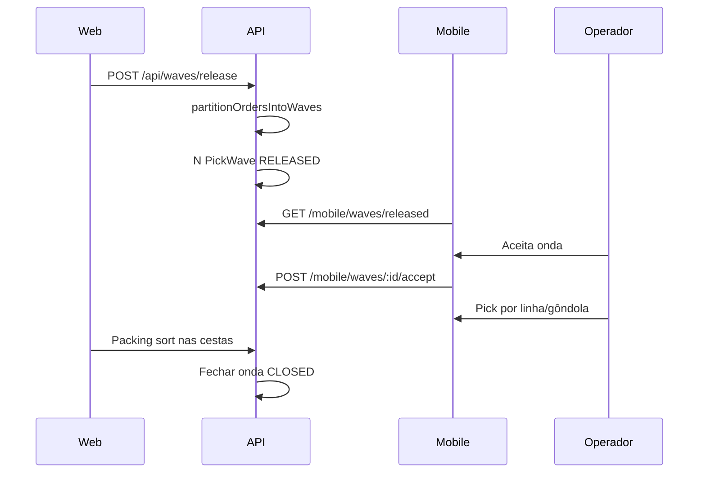

# Lógica de ondas e fila de packing

Documento de referência para explicar ao cliente e ajustar regras por tenant. Implementação principal em `apps/api/src/services/`.

## Glossário

| Termo | Significado |
|-------|-------------|
| **Onda** | Lote de pedidos `PENDING` liberados juntos para separação consolidada (`PickWave` status `RELEASED`). |
| **Linha de onda** | Uma passagem na gôndola: combinação **produto + localização** (`PickWaveLine`). |
| **Alocação** | Quantidade de um item de pedido atribuída à linha (`PickWaveAllocation`). |
| **Packing de onda** | No web, distribuir quantidades coletadas nas cestas de cada pedido (sort). |
| **Packing de pedido** | Conferir itens bipando produto após separação individual. |

## Quem entra na onda

- Pedidos com status `PENDING` e **sem** vínculo em outra onda ativa.
- Filtros em `buildWaveCandidateOrders` (`pick-wave.ts`):
  - `wave.onlyDeadlineToday`: só coleta no dia corrente.
  - `wave.autoRelease.maxOrders`: limite de pedidos por liberação automática.
- Ordem de candidatos: `priority` desc, `collectionDeadline` asc, `createdAt` asc.

## Várias ondas na mesma liberação

Configuração (`wave-settings.ts`):

| Chave | Padrão | Efeito |
|-------|--------|--------|
| `wave.partition.enabled` | `true` | Ativa partição greedy por produto |
| `wave.partition.minOrdersPerWave` | `3` | Grupo menor é ignorado ou fundido |
| `wave.partition.maxWavesPerBatch` | `10` | Teto de ondas por release |

Algoritmo (`pick-wave-partition.ts`):

1. Para cada produto P, conjunto O(P) = pedidos com item pendente de P.
2. Produtos ordenados por |O(P)| decrescente (maior consolidação primeiro).
3. Para cada P, forma onda com pedidos de O(P) ainda não atribuídos (se |grupo| ≥ mínimo).
4. Pedido com vários SKUs entra na **primeira** onda que o incluir (produto âncora).

**Exemplo:** 5 pedidos só com SKU-A → onda 1; 10 pedidos só com SKU-B → onda 2. Pedido com A+B segue a onda do SKU cujo grupo foi formado primeiro.

Várias ondas podem ficar `RELEASED` ao mesmo tempo. O mobile lista em `/mobile/waves/released` e o operador escolhe qual aceitar.

## Passagens na gôndola e multi-gôndola

- Chave da linha: `productId` + `pickLocationId`.
- Alocação de quantidade (`pick-allocation.ts`):
  1. Lista gôndolas `PICK_FACE` do SKU, ordenadas por rota.
  2. Em cada face, usa até `min(saldo, restante)`.
  3. Se saldo total < necessário, completa na face de menor saldo (shortfall).

**Exemplo:** pedido precisa de 100 un.; duas gôndolas com 50 cada → duas linhas de onda (ou hint no packing: "50 un. em A-01 · 50 un. em B-02").

## Prioridade e coleta

`computeOrderPriority` (`marketplace-priority.ts`) gera score 0–100:

| Situação | Score aproximado |
|----------|------------------|
| Coleta já passou | 100 |
| ≤ 2 h para coleta | 95 |
| ≤ 4 h | 85 |
| ≤ 8 h | 70 |
| ≤ 24 h | 55 |
| Marketplace Mercado Livre | +5 base |

Na fila de packing, `scorePackingUrgency` aplica bônus extra se a coleta é **hoje**.

## Ordenação no packing (web)

Endpoint unificado: `GET /api/packing/queue/unified`

1. **Linhas de onda** sempre antes dos pedidos.
2. Dentro de ondas: urgência agregada (max dos pedidos) desc, depois rota da gôndola (`packing-queue-sort.ts`).
3. Pedidos: urgência desc, proximidade em rota (serpentine), deadline asc.

## Fluxo operacional

## Ajuste de contagem no mobile

Quando o operador vê saldo divergente na gôndola ou no pulmão durante a separação:

1. Botão **Corrigir estoque na gôndola** em `pick.tsx` e na pick de onda.
2. Informa a **quantidade contada** (valor absoluto, 0 até capacidade).
3. API `POST /mobile/locations/:id/adjust-quantity` grava `currentQuantity` e movimento `ADJUSTMENT`.

**Reconciliação automática** (`pick-location-reconcile.ts`), escopo **todo SKU ativo**:

| Alvo | Comportamento |
|------|----------------|
| Pedidos `PENDING` / `PICKING` | Recalcula `orderItem.pickLocationId` via `allocateQuantityAcrossPickFaces` / `resolvePickFaceForProduct` |
| Linhas de onda `RELEASED` sem pick | Pode mover linha para outra gôndola (mesmo produto) |
| Linha de onda já iniciada | Apenas aviso se saldo < pendente |
| Ajuste em **pulmão** | Atualiza saldo do pulmão; **não** altera faces de pick dos pedidos |

Após o ajuste, a sessão de picking do pedido é recarregada (`routeQueue`, `nextItem`) para refletir nova gôndola.

## Arquivos de código

| Regra | Arquivo |
|-------|---------|
| Partição de ondas | `pick-wave-partition.ts` |
| Liberação / linhas | `pick-wave.ts` |
| Multi-gôndola | `pick-allocation.ts` |
| Ordenação packing | `packing-queue-sort.ts`, `order-packing.ts` |
| Ajuste de estoque | `location-adjust.ts`, `pick-location-reconcile.ts` |
| Configurações | `wave-settings.ts` |
| UI packing | `apps/web/app/(dashboard)/packing/page.tsx` |
| Mobile ondas / pick | `apps/mobile/app/wave-picking/`, `apps/mobile/app/picking/[orderId]/pick.tsx` |

## Como alterar para o cliente

1. Ajustar chaves `wave.*` em Configurações do tenant (ou `system_settings`).
2. Para mudar algoritmo de partição, editar `partitionOrdersIntoWaves`.
3. Para mudar prioridade de coleta, editar `computeOrderPriority` / `scorePackingUrgency`.
4. Reexecutar seed ou liberar onda de teste e validar preview em `/api/waves/preview` (campo `waves[]`).
