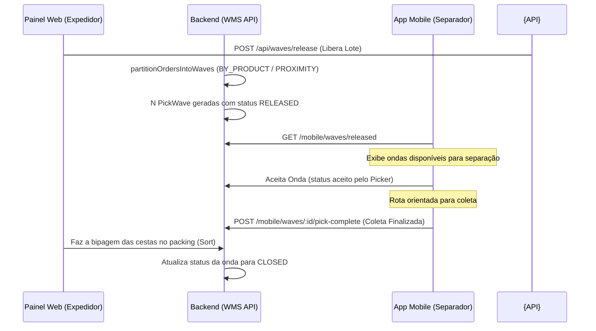

# 🌊 Lógica de Ondas e Fila de Packing

Este documento serve como referência técnica e operacional para a liberação consolidada de pedidos (ondas de separação) e gerenciamento da fila de packing no WMS.

---

## 📖 Glossário

| Termo | Significado |
| :--- | :--- |
| **Onda** | Lote de pedidos `PENDING` liberados juntos para separação consolidada (`PickWave` status `RELEASED`). |
| **Linha de onda** | Uma tarefa de coleta física na gôndola: combinação **produto + localização** (`PickWaveLine`). |
| **Alocação** | Quantidade de um item de pedido específica atribuída a uma linha de onda (`PickWaveAllocation`). |
| **Packing de onda** | Distribuição e triagem dos produtos coletados consolidados em cestas individuais no web dashboard. |
| **Packing de pedido** | Conferência unitária de itens bipando o código de barras do produto após separação dedicada. |

---

## 🎯 Candidatos à Onda

A seleção de pedidos candidatos a entrar na onda ocorre na função `buildWaveCandidateOrders` dentro de `pick-wave.ts`:
1.  **Filtros Básicos**:
    *   Pedidos com status `PENDING`.
    *   Pedidos que **não** possuem vínculo em nenhuma onda ativa.
    *   Se a configuração `wave.onlyDeadlineToday` estiver ativa: apenas pedidos com deadline no dia atual.
2.  **Ordenação de Prioridade**:
    *   O WMS prioriza os candidatos pela ordem: `priority` (decrescente), `collectionDeadline` (crescente) e `createdAt` (crescente).

---

## 🔀 Algoritmos de Particionamento (Várias Ondas por Release)

A partição de ondas divide um lote grande de pedidos candidatos em grupos menores e focados para separação unificada. O comportamento é parametrizado em `wave-settings.ts`.

O WMS oferece três estratégias de particionamento em `pick-wave-partition.ts`:

### 1. Greedy por Agrupamento de Produto (`BY_PRODUCT`) - *Padrão*
*   **Foco**: Consolidar coletas de SKUs idênticos no galpão.
*   **Funcionamento**:
    1.  Filtra apenas pedidos com no máximo 5 SKUs distintos.
    2.  Calcula a frequência de cada produto em aberto.
    3.  Seleciona o produto de maior frequência e cria um grupo.
    4.  Associa pedidos que compartilham deste produto (e produtos vizinhos por rota física) até atingir o limite mínimo (`wave.partition.minOrdersPerWave`) e teto máximo da onda.
    5.  Pedidos multifuncionais seguem o produto cuja onda foi agrupada primeiro (produto âncora).

### 2. Agrupamento por Rota Física (`PROXIMITY`)
*   **Foco**: Minimizar a distância percorrida pelo operador entre as gôndolas.
*   **Funcionamento**:
    1.  Gera um perfil de locais de gôndola (`OrderPickProfile`) para cada pedido pendente.
    2.  Agrupa os pedidos em clusters físicos onde as localizações de coleta estão próximas na serpentine de rota do armazém.
    3.  Usa o limite de distância configurado em `wave.proximityMaxDistance` para delimitar até onde um separador pode andar em uma única onda.

### 3. Pedidos Monocanal / Item Único (`SINGLE_ITEM`)
*   **Foco**: Separação expressa de pedidos de e-commerce que possuem exatamente **uma unidade de um único SKU**.
*   **Funcionamento**:
    1.  Filtra apenas pedidos mono-item e monocantidade.
    2.  Agrupa por proximidade física de rota e forma ondas de picking consolidadas de alta velocidade. O separador vai a poucas gôndolas e resolve dezenas de pedidos de uma vez.

---

## 🛣️ Rota de Coleta e Multi-Gôndolas (`pick-allocation.ts`)

A linha de onda (`PickWaveLine`) consolida as quantidades agregadas dos produtos. A alocação física de qual gôndola o separador retirará o item é calculada no arquivo `pick-allocation.ts`:

1.  Lista as gôndolas cadastradas como `PICK_FACE` do SKU, ordenadas pela sequência lógica de rota (serpentine do galpão).
2.  Aloca as quantidades em cada endereço usando o menor número de paradas, aplicando `min(saldo, restante)`.
3.  Caso a soma das frentes de pick ativa seja menor que a necessária (ruptura de gôndola), o WMS sugere a gôndola de menor saldo e dispara um alerta de reabastecimento.

---

## ⏱️ Prioridade de Coleta e Urgência do Packing

A prioridade do pedido é calculada em `marketplace-priority.ts` gerando um score de `0` a `100`:

| Janela para Coleta / Marketplace | Score WMS |
| :--- | :--- |
| Prazo de coleta expirado | `100` |
| $\le$ 2 horas para coleta | `95` |
| $\le$ 4 horas para coleta | `85` |
| $\le$ 8 horas para coleta | `70` |
| $\le$ 24 horas para coleta | `55` |
| Integração Mercado Livre | `+5` (bônus na base do score) |

Na mesa de packing (fila de expedição), o algoritmo aplica bônus extra de urgência caso a coleta ocorra no dia corrente.

---

## 📦 Fila Unificada e Ordenação no Packing (`packing-queue-sort.ts`)

O painel web busca o endpoint unificado `GET /api/packing/queue/unified` para exibir as cestas prontas para expedição. A ordenação respeita as seguintes prioridades:

1.  **Ondas de Separação Coletadas (`PICKED`)**: Aparecem sempre no topo da fila, pois seus itens já foram retirados do armazém e estão ocupando cestas físicas físicas que precisam ser liberadas.
2.  **Pedidos Dedicados**: Ordenados por urgência da coleta (score decrescente), proximidade em rota e deadline.

---

## 🔁 Fluxo Operacional de Ondas

---

## 🔧 Correção de Estoque no Mobile e Reconciliação
Quando o operador identifica uma divergência física de estoque na gôndola durante a separação:
1.  Ele clica em **Corrigir estoque na gôndola** na tela de coleta do app.
2.  Informa a quantidade real física contada (ex: `0`).
3.  A API processa o ajuste (`adjustLocationQuantity`) e dispara a reconciliação automática de rotas (`reconcilePickTargetsAfterStockChange`).

Para ver em detalhes como esse processo repara os pedidos e as ondas afetadas sem parar a operação, acesse o documento [[reabastecimento-estoque|Reabastecimento e Reconciliação]].
