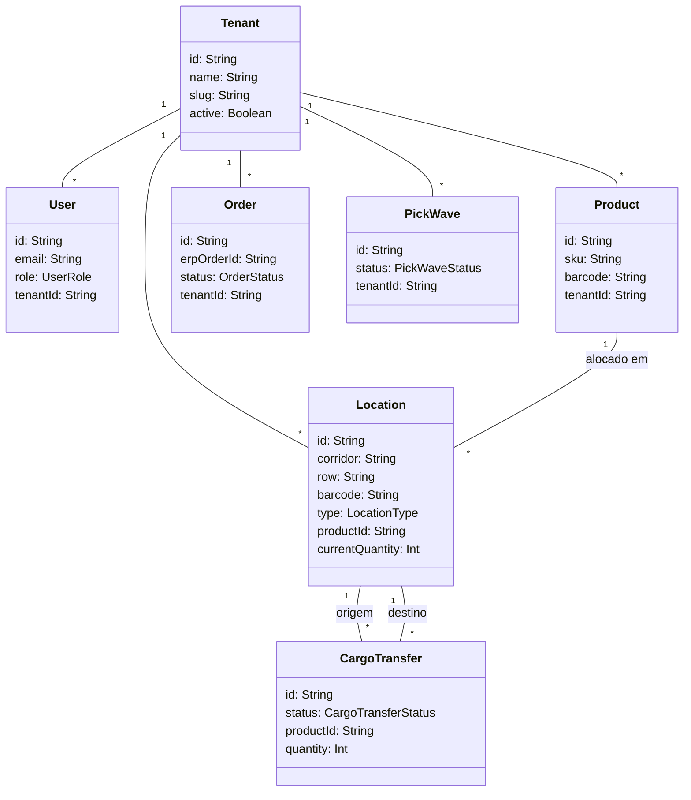

# 🗄️ Modelagem de Dados e Banco de Dados

O banco de dados do **Zentor WMS** é relacional e estruturado no **PostgreSQL**, sendo gerenciado através do **Prisma ORM**. Todas as interações com tabelas de domínio do negócio respeitam o escopo de multi-tenancy usando a coluna `tenantId`.

---

## 🗺️ Visão Lógica dos Modelos (Prisma Schema)

O banco de dados é dividido logicamente em áreas de responsabilidade:

---

## 🗂️ Tabelas Principais (Dicionário de Modelos)

### 🏢 Núcleo Corporativo (Multi-Tenancy)
*   **`Tenant` (tabela: `tenants`)**: Define os clientes da plataforma (empresas independentes). Cada registro possui um `slug` único (ex: `demo-loja-a`).
*   **`User` (tabela: `users`)**: Armazena as credenciais, papéis (`UserRole`) e permissões granulares dos usuários de galpão e administradores. Associa-se a um `Tenant` (exceto o Super-Admin).
*   **`SystemSetting` (tabela: `system_settings`)**: Armazena chaves de configuração personalizadas por tenant (ex: comportamento das ondas, segredos de webhook).

### 🏷️ Estrutura Física do Armazém e Cadastro
*   **`Product` (tabela: `products`)**: Cadastros de produtos com `sku` e `barcode` únicos por tenant. Armazena a flag `requiresItemScan` (se exige leitura unitária no packing).
*   **`Location` (tabela: `locations`)**: Mapeamento físico das localizações. Contém informações de corredor, fileira, capacidade máxima, saldo físico (`currentQuantity`) e limite mínimo (`minThreshold`) para reposição.
*   **`Basket` (tabela: `baskets`)**: Cadastro de cestas físicas (ou totes) usadas para consolidar itens coletados durante ondas de separação múltipla.

### 🧾 Lógica Inbound (Recebimento e Guardagem)
*   **`PurchaseReceiptSession` (tabela: `purchase_receipt_sessions`)**: Sessão de conferência de mercadorias no caminhão. Armazena a chave DANFE (`accessKey`), o fornecedor e o status da conferência.
*   **`PurchaseReceiptItem` (tabela: `purchase_receipt_items`)**: Itens vinculados à nota fiscal de entrada, contendo quantidade esperada vs. quantidade física contada pelo expedidor.
*   **`PutawaySession` (tabela: `putaway_sessions`)**: Sessão que controla o armazenamento dos itens conferidos no recebimento nas posições de pulmão do armazém.

### 📦 Lógica de Pedidos e Separação (Outbound)
*   **`Order` (tabela: `orders`)**: Pedidos importados do ERP (Tiny). Contém o identificador do pedido no ERP (`erpOrderId`), marketplace de origem, notas e status atual.
*   **`OrderItem` (tabela: `order_items`)**: Linhas do pedido relacionando o produto, quantidade pedida, quantidade separada (`quantityPicked`) e quantidade embalada (`quantityPacked`).
*   **`PickWave` (tabela: `pick_waves`)**: Ondas de separação consolidada. Agrupa múltiplos pedidos que serão coletados de forma unificada na gôndola.
*   **`PickWaveLine` (tabela: `pick_wave_lines`)**: Agrupamento físico na onda (combinação de **produto + localização**). Define a tarefa do separador no mobile (ex: "Vá na localização A-01 e pegue 10 unidades do SKU X").
*   **`PickWaveAllocation` (tabela: `pick_wave_allocations`)**: Tabela de junção que mapeia quais unidades coletadas na `PickWaveLine` pertencem a quais itens de pedidos (`OrderItem`).

### 🔄 Histórico e Movimentação Interna
*   **`InventoryMovement` (tabela: `inventory_movements`)**: Log imutável e auditável de todas as transações de estoque (entradas, transferências, reposições, ajustes e baixas).
*   **`CargoTransfer` (tabela: `cargo_transfers`)**: Representa o transporte de paletes/caixas fechadas do Pulmão até o giro da Gôndola de Separação. Possui status `IN_TRANSIT` enquanto a carga estiver no carrinho do reabastecedor.
*   **`ReplenishmentAssignment` (tabela: `replenishment_assignments`)**: Tarefa de reabastecimento vinculada a um operador específico para alimentar gôndolas que caíram abaixo do limite mínimo.

---

## ⚙️ Enums Críticos do Sistema

### Papéis Operacionais (`UserRole`)
*   `PICKER`: Separador de ondas de pedidos via mobile.
*   `EXPEDITER`: Operador web (conferência de compras, faturamento e packing).
*   `REPLENISHER`: Operador de movimentação interna de estoque mobile.
*   `ADMIN`: Administrador completo do tenant.

### Tipos de Localização (`LocationType`)
*   `PICK_FACE`: Gôndola ativa de separação de mercadorias (estoque de giro). Cada SKU possui gôndolas prioritárias.
*   `PULMAO`: Estoque de reserva física em posições mais elevadas ou áreas separadas do armazém.

### Status do Pedido (`OrderStatus`)
*   `PENDING`: Pedido recebido e aguardando processamento/onda.
*   `PICKING`: Itens reservados e em processo de separação física.
*   `PAUSED_ISSUE`: Separação interrompida devido a alguma divergência (ex: falta de estoque físico).
*   `PICKED_AWAITING_CONFERENCE`: Coleta física terminada; pedidos na cesta aguardando bipagem na mesa de packing.
*   `PACKING_RETURNED_TO_PICKING`: Pedido retornou para a separação devido a erro ou perda detectada no packing.
*   `DISPATCHING`: Pedido embalado e aguardando bipagem do motorista/coleta.
*   `DISPATCHED`: Pedido enviado e finalizado no armazém.

### Movimentações de Estoque (`InventoryMovementType`)
*   `ENTRY`: Entrada física inicial de mercadorias no galpão.
*   `EXIT`: Saída definitiva (expedição do pedido ou perda/descarte).
*   `TRANSFER`: Movimentação direta entre endereços.
*   `ADJUSTMENT`: Correção de inventário física feita por contagem do operador.
*   `PICK_ALLOCATION`: Reserva e baixa do estoque da gôndola atrelada à separação do pedido.
*   `REPLENISHMENT`: Entrada de reabastecimento na gôndola vinda do pulmão.

Para entender os fluxos práticos que utilizam esses modelos, acesse a documentação do [[fluxo-recebimento-putaway|Fluxo de Recebimento e Guardagem]] ou do [[reabastecimento-estoque|Fluxo de Reabastecimento]].
