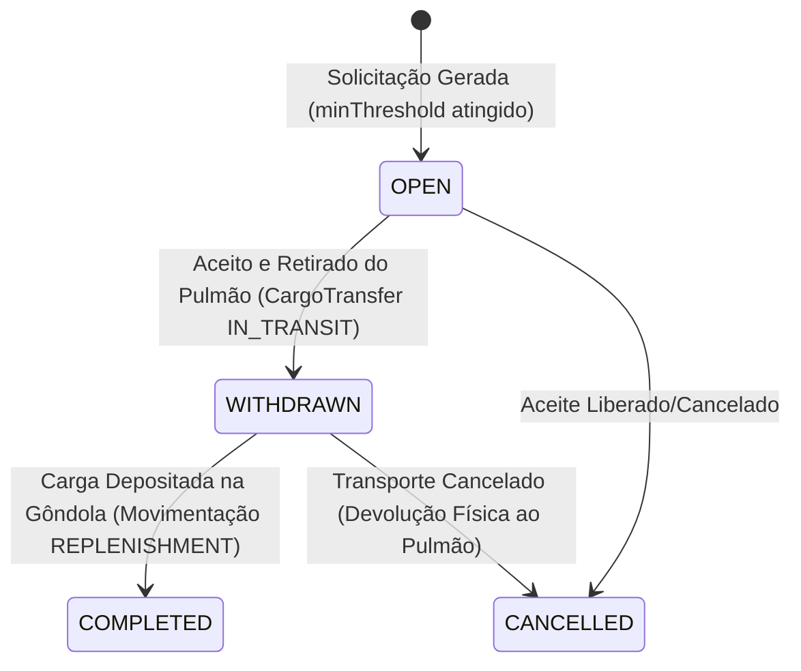

# 🔄 Fluxo de Reabastecimento de Estoque e Reconciliação

O fluxo de reabastecimento do **Zentor WMS** garante que as gôndolas de separação ativa (`PICK_FACE`) estejam sempre abastecidas com produtos suficientes vindos do estoque de reserva (`PULMAO`).

---

## ⚙️ Gatilhos e Cálculo de Necessidade

O reabastecimento é disparado automaticamente de forma reativa a partir dos saldos das gôndolas:

1.  **Limites da Gôndola**: Toda localização configurada como `PICK_FACE` possui as propriedades:
    *   `capacity`: Capacidade física máxima de armazenamento do endereço.
    *   `minThreshold`: Ponto de pedido (estoque mínimo tolerado).
2.  **Gatilho de Reposição**: Quando a quantidade atual (`currentQuantity`) de um produto na gôndola cai para um valor **menor ou igual** ao `minThreshold`, a gôndola entra no status de necessidade de reabastecimento.
3.  **Cálculo do Deficit**: O WMS calcula dinamicamente a quantidade necessária para completar a gôndola. O deficit sugerido é a quantidade que eleva a gôndola de volta à sua capacidade máxima (respeitando limites físicos).
4.  **Sugestão de Origem (Pulmão)**: O serviço `listReplenishmentNeeds` busca em todas as posições de `PULMAO` pelo mesmo produto. Ele seleciona e sugere o endereço de pulmão que possui o maior saldo disponível para reabastecer a gôndola.

---

## 🚚 Ciclo de Vida do Reabastecimento (`CargoTransfer`)

O fluxo segue quatro fases operacionais executadas no aplicativo mobile:

### 1. Aceite da Fila (`OPEN`)
*   O operador mobile acessa a fila de reposição (`listReplenishmentNeedsForMobile`).
*   Ele aceita a tarefa para uma gôndola alvo. Isso cria um registro `ReplenishmentAssignment` em status `OPEN` reservado a ele, bloqueando que outros operadores aceitem a mesma gôndola.

### 2. Retirada do Pulmão (`WITHDRAWN`)
*   O operador se desloca até o pulmão sugerido, bipe o endereço de pulmão, bipe o produto e informa a quantidade retirada.
*   O WMS aciona `withdrawCargoTransfer` que:
    *   Cria um registro `CargoTransfer` em status `IN_TRANSIT` atrelado ao operador.
    *   Subtrai a quantidade retirada do endereço de pulmão (`currentQuantity`).
    *   Grava um movimento de estoque do tipo **`TRANSFER`** indicando que o estoque saiu do pulmão, mas ainda não entrou na gôndola (está em trânsito com o operador).
    *   Muda o status do reabastecimento para `WITHDRAWN`.

### 3. Depósito na Gôndola (`COMPLETED`)
*   O operador leva o produto físico até a gôndola de destino.
*   Ele bipe a gôndola ativa de giro (`PICK_FACE`), bipe o produto e informa a quantidade.
*   O WMS aciona `depositCargoTransfer` que:
    *   Incrementa a quantidade informada na gôndola (`Location.currentQuantity`).
    *   Muda o status do `CargoTransfer` para `COMPLETED`.
    *   Grava o histórico de movimentação do tipo **`REPLENISHMENT`** de pulmão para gôndola.
    *   Atualiza o status do `ReplenishmentAssignment` para `COMPLETED`.

### 4. Cancelamento do Transporte (`CANCELLED`)
*   Se o operador precisar cancelar o reabastecimento após já ter retirado o item do pulmão, ele executa a ação de cancelamento.
*   O serviço `cancelCargoTransfer`:
    *   Retorna a quantidade em trânsito de volta para o endereço de pulmão de origem.
    *   Grava um movimento de estoque de ajuste indicando o retorno físico do estoque.
    *   Define o status do `CargoTransfer` e do `ReplenishmentAssignment` como `CANCELLED`.

---

## ⚡ Reconciliação Reativa de Picking (`Pick Location Reconcile`)

Durante a atividade de separação de pedidos ou ondas de coleta no mobile, o operador pode notar que o saldo indicado pelo sistema na gôndola não condiz com a realidade física (ex: sistema diz que tem 10 unidades, mas a gôndola está vazia).

### Lógica de Ajuste e Reconciliação (`pick-location-reconcile.ts`)

Quando o separador relata uma divergência física e aciona a **Correção de Estoque** no celular:

1.  **Ajuste do Endereço**: A quantidade real contada pelo separador é gravada na gôndola e uma movimentação do tipo `ADJUSTMENT` registra a quebra de estoque.
2.  **Varredura de Pedidos Pendentes (`PENDING` ou `PICKING`)**:
    *   O WMS busca todas as linhas de pedidos ativos (`OrderItem`) que estavam programadas para coletar daquela gôndola agora comprometida.
    *   Ele aciona `reconcilePickTargetsAfterStockChange`, que recalcula o local de coleta desses itens através do método `allocateQuantityAcrossPickFaces`.
    *   Os pedidos pendentes são migrados automaticamente para outras gôndolas saudáveis que possuam estoque do mesmo SKU.
3.  **Ajuste de Ondas Liberadas (`RELEASED`)**:
    *   Se a linha de onda (`PickWaveLine`) ainda **não** tiver sido iniciada pelo separador, o WMS move automaticamente a linha da gôndola divergente para outra gôndola disponível.
    *   Se a linha de onda já estiver em andamento (coleta parcial iniciada), o sistema **não** altera o endereço automaticamente para evitar confusão física com as cestas do operador. Em vez disso, gera um alerta (`warning`) na tela do operador indicando saldo insuficiente e solicita tratamento.
4.  **Recarregamento Automático**: A fila de rotas do separador no celular é imediatamente atualizada com as novas localizações.

Para visualizar a lógica de divisão e distribuição dos pedidos que entram na onda de separação, consulte o guia [[logica-ondas|Lógica de Ondas e Packing]].
