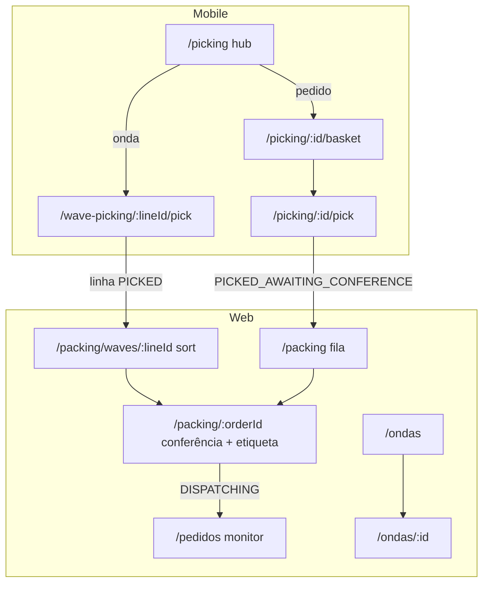

# Design: geração de etiqueta Tiny no packing

Relacionado: [[etiquetas-expedicao-tiny]], [[integracao-tiny-pedidos]], [[logica-ondas]].

**Status:** aprovado via mapa tela a tela (plano de inventário).  
**Decisão de encaixe:** opção **A** — gerar no “Buscar etiqueta” da conferência de packing.

---

## 1. Inventário tela a tela (validado)

Objetivo: localizar onde a etiqueta Tiny existe hoje e onde a **geração** (criar agrupamento de expedição) deve entrar.

### Fluxo entre telas

### WEB

| # | Rota | Função | Etiqueta |
|---|------|--------|----------|
| 1 | `/pedidos` | Monitor read-only (abas de status + ondas). Sem mutação. | Não |
| 2 | `/expedicao` | Redirect para `/pedidos`. Sem UI. | Não |
| 3 | `/ondas` | Montar / liberar / encerrar ondas. | Não |
| 4 | `/ondas/[id]` | Detalhe: add/remove pedidos, encerrar. | Não |
| 5 | `/ondas/configuracoes` | Settings de ondas. | Não |
| 6 | `/packing` | Fila unificada (ondas a sortar, pedidos a conferir, reposição info). Bipar cesta / abrir. | Entrada apenas |
| 7 | `/packing/[orderId]` | Conferência: bip, confirmar, finalizar → `DISPATCHING`, problema → retorno picking. Painel “Etiqueta de envio”. | **Única tela** — Buscar / Abrir / Atualizar |
| 8 | `/packing/waves/[lineId]` | Sort de linha de onda → `SORTED`. | Não |
| 9 | `/integracoes/tiny` | OAuth e sync admin. | Não |

Arquivos principais:

- `apps/web/app/(dashboard)/packing/[orderId]/page.tsx` — UI de etiqueta
- `apps/api/src/services/tiny-shipping-labels.ts` — `fetchShippingLabelsForOrder` (só GET)
- `apps/api/src/services/tiny-expedicao-labels.ts` — clientes GET expedição/etiquetas
- `apps/api/src/routes/web.ts` — `POST /api/packing/orders/:id/shipping-labels`

### MOBILE

| # | Rota | Função | Etiqueta |
|---|------|--------|----------|
| 10 | `/picking` | Hub Ondas / Pedidos / Problemas | Não |
| 11 | `/picking/[orderId]/basket` | Vincular cesta | Não |
| 12 | `/picking/[orderId]/pick` | Separar → `PICKED_AWAITING_CONFERENCE` | Não |
| 13 | `/wave-picking` (+ painel Ondas) | Aceitar onda, listar linhas | Não |
| 14 | `/wave-picking/[lineId]/pick` | Pick consolidado → linha `PICKED`; packing no web | Não |
| 15 | `/wave-picking/[lineId]/sort` | Sort mobile (legado; fluxo principal no web) | Não |

### Lacuna atual

Hoje “Buscar etiqueta” só **consulta** a Tiny. Se o pedido não está em agrupamento (`NOT_IN_EXPEDICAO`), falha. A API Tiny exige `POST /expedicao` com `idsPedidos` (ou `idsNotasFiscais`) para criar o agrupamento antes das URLs existirem.

Doc operacional: [[etiquetas-expedicao-tiny]].

---

## 2. Decisão: momento da geração

### Opções consideradas

| Opção | Momento | Prós | Contras |
|-------|---------|------|---------|
| **A** | Botão “Buscar etiqueta” no packing | Operador controla; reutiliza endpoint e UI; não bloqueia finalizar packing | Etiqueta opcional até o clique |
| B | Automático no “Finalizar packing” | Sempre tenta gerar | Atrasa complete; falha Tiny pode confundir com falha de packing; gera agrupamento mesmo se operador não precisa imprimir agora |
| C | Nova tela pós-`DISPATCHING` | Separação clara de papéis | `/expedicao` hoje é redirect; exige UI nova |

### Escolha: **A**

Gerar (criar agrupamento) **dentro do fluxo de “Buscar etiqueta”** quando o status for `NOT_IN_EXPEDICAO`, depois buscar as URLs no mesmo request.

Motivos:

1. Única tela que já fala de etiqueta.
2. Doc existente já apontava esse próximo passo.
3. Não altera a transição `PICKED_AWAITING_CONFERENCE` → `DISPATCHING`.
4. Operador pode conferir sem chamar Tiny; só gera quando precisa imprimir.

**Fora de escopo desta geração:** concluir agrupamento (`POST /expedicao/{id}/concluir`), marcar `DISPATCHED` no WMS, write-back de status no Tiny, tela `/expedicao` dedicada.

---

## 3. Design da geração

### Comportamento desejado

No `POST /api/packing/orders/:id/shipping-labels` (mesmo botão “Buscar etiqueta” / “Atualizar”):

1. Cache hit em `Order.shippingLabel` (salvo `?refresh=1`) → retorna `OK` como hoje.
2. Parse `erpOrderId` → `TINY-{id}`; senão `NOT_TINY_ORDER`.
3. Índice de expedição (GET listagem + detalhes) → se achar pedido, buscar etiquetas (igual hoje).
4. Se **não** achar (`NOT_IN_EXPEDICAO`):
   - `POST /expedicao` body `{ "idsPedidos": [pedidoId] }` → `{ id: idAgrupamento }`.
   - Reindexar ou `GET /expedicao/{idAgrupamento}` e localizar a expedição do pedido.
   - Buscar URLs (`.../etiquetas` lote + individual).
5. Persistir primeira URL em `Order.shippingLabel` quando houver.
6. Retornar `ShippingLabelResult` enriquecido (ver abaixo).

### API Tiny (referência)

- Criar: [POST /expedicao](https://api-docs.erp.olist.com/api-reference/expedição/criar-agrupamento-de-expedição) — body `idsPedidos` e/ou `idsNotasFiscais`; response `{ id }`.
- Etiquetas: rotas GET já usadas em `tiny-expedicao-labels.ts`.

Preferência inicial: **`idsPedidos`** a partir de `parseTinyPedidoId(erpOrderId)`. Não exigir NF no WMS nesta versão. Se a Tiny rejeitar (ex.: pedido exige NF), mapear erro para status novo ou `API_ERROR` com mensagem da Tiny.

### Tipos / status

Estender `ShippingLabelStatus` / resultado:

| Status | Significado |
|--------|-------------|
| `OK` | URLs obtidas (já existia ou após gerar); usar `createdAgrupamento: true` quando o POST rodou nesta chamada |
| `NOT_IN_EXPEDICAO` | Só se criação falhar em localizar o pedido após o create |
| `CREATE_EXPEDICAO_ERROR` | `POST /expedicao` falhou (mensagem Tiny) |
| Demais | Iguais aos atuais (`NOT_TINY_ORDER`, `MARKETPLACE_ERROR`, `NO_URLS`, `API_ERROR`) |

Manter `status: "OK"` e adicionar `createdAgrupamento?: boolean` para a UI mostrar “Agrupamento criado na Tiny” sem quebrar clientes.

### Componentes

| Unidade | Responsabilidade |
|---------|------------------|
| `criarAgrupamentoExpedicao(client, { idsPedidos })` em `tiny-expedicao-labels.ts` | Wrapper POST `/expedicao` |
| `ensurePedidoInExpedicao` (mesmo arquivo ou `tiny-shipping-labels.ts`) | Se não no índice → create → reload match |
| `fetchShippingLabelsForOrder` | Orquestra cache → índice → ensure → etiquetas → persist |
| Rota web | Sem mudança de path nem query nova |
| UI packing | Mensagens claras para `CREATE_EXPEDICAO_ERROR` / marketplace; botão com copy “Buscar / gerar etiqueta” |

### Erros e edge cases

- **Pedido já em expedição:** não chama POST; só GET etiquetas.
- **Race / double-click:** Tiny pode rejeitar pedido já agrupado; tratar como sucesso e seguir para GET.
- **Marketplace sem URL:** após create, ainda pode vir `MARKETPLACE_ERROR` / `NO_URLS` — mensagem operacional igual à doc.
- **Tiny desconectado:** `API_ERROR` como hoje.
- **Não Tiny:** `NOT_TINY_ORDER` — sem POST.
- **Rate limit:** cliente Tiny existente já trata 429.

### UI (packing detail)

- Manter botões atuais; após sucesso com `createdAgrupamento`, mensagem tipo: “Pedido agrupado na expedição Tiny. Etiqueta pronta.”
- Em falha de create: âmbar/vermelho com `message` da API.
- Não bloquear “Finalizar packing” se etiqueta falhar.

### Testes

- Unit: `parseTinyPedidoId` (já existe contexto); mock client:
  - índice vazio → POST chamado → depois match + urls → `OK` + `createdAgrupamento`
  - índice com match → POST **não** chamado
  - POST 400 → `CREATE_EXPEDICAO_ERROR`
- Seguir padrão dos testes em `apps/api/src/services/tiny-*.test.ts`.

### Segurança / permissão

Continuar `Permission.SHIPPING_VIEW` no mesmo endpoint (já usado para buscar).

---

## 4. Fora de escopo

- Agrupar vários pedidos no mesmo `POST` (lote).
- Usar `idsNotasFiscais` como caminho principal.
- Concluir agrupamento / marcar enviado na Tiny.
- Tela de expedição WMS.
- Geração automática no complete packing.

---

## 5. Critérios de sucesso

1. Operador em `/packing/[orderId]` clica “Buscar etiqueta” em pedido Tiny fora da expedição e recebe URL (quando marketplace/Tiny permitir).
2. Pedido já em expedição continua só com GET (sem POST redundante bem-sucedido desnecessário).
3. Falhas de create/marketplace aparecem na UI sem impedir finalizar packing.
4. Testes unitários cobrem create-on-miss e skip-when-found.
