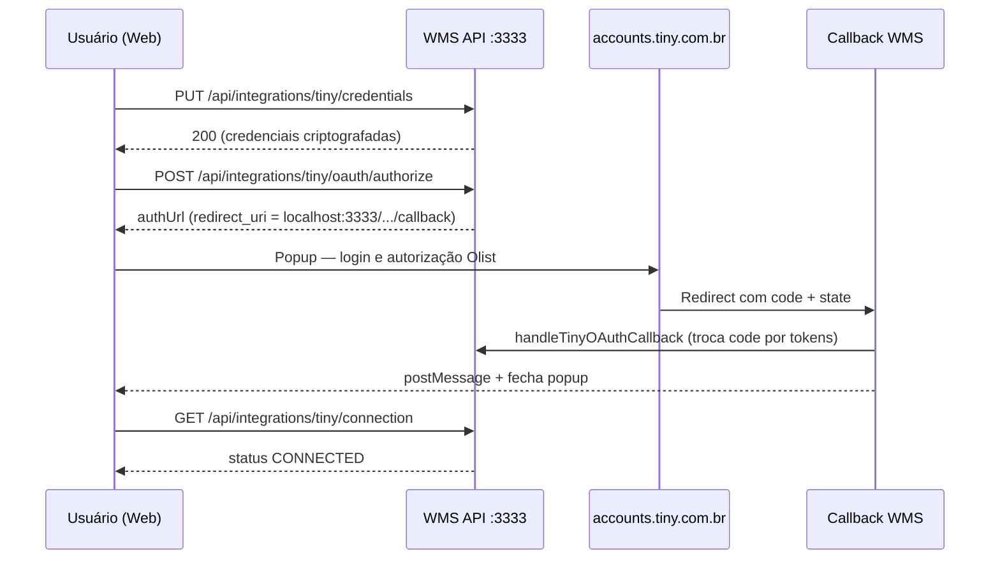

# Conexão da conta Tiny/Olist — histórico e ajustes

Este documento registra **como estava a integração OAuth antes dos ajustes**, **quais problemas apareceram ao conectar a conta** e **o que foi corrigido** para o fluxo funcionar em desenvolvimento local.

Para a referência técnica contínua (rate limit, refresh de tokens, criptografia), consulte [[integracao-tiny-oauth|Integração Tiny ERP (v3)]].

---

## Contexto

A integração usa **OAuth 2.0 / OpenID Connect** da **Olist ERP API v3** (Tiny), conforme documentação oficial:

- Autenticação: https://api-docs.erp.olist.com/documentacao/comecando/autenticacao
- URL de login: `https://accounts.tiny.com.br/realms/tiny/protocol/openid-connect/auth`
- Callback do WMS: `{API_PUBLIC_URL}/integrations/tiny/oauth/callback`

Tela no painel web: `/integracoes/tiny`.

---

## Como estava antes (problemas encontrados)

Durante os testes locais na branch `integracaotiny`, a conexão da conta falhava em etapas diferentes. Abaixo, o comportamento observado e a causa raiz de cada um.

### 1. Erro ao salvar credenciais — CORS / Failed to fetch

| Sintoma | `PUT /api/integrations/tiny/credentials` bloqueado no navegador |
| Causa | A API não permitia métodos `PUT`, `PATCH` e `DELETE` na configuração CORS |
| Estado anterior | Apenas `GET` e `POST` estavam liberados em `apps/api/src/index.ts` |

### 2. Erro ao salvar credenciais — Permissão negada (403)

| Sintoma | Resposta `{ "error": "Permissão negada" }` e crash na UI |
| Causa | Rotas de mutação da integração Tiny usavam `requireSettingsManage` (`settings.manage`) |
| Estado anterior | A tela exige `olist.configure`, mas o usuário de teste `operador@wms.local` (role `EXPEDITER`) **não** possui `settings.manage` |
| Impacto | Quem tinha acesso ao menu Tiny não conseguia salvar credenciais nem iniciar OAuth |

### 3. Botão “Conectar com Olist” desabilitado

| Sintoma | Botão permanecia cinza mesmo com Client ID e Secret preenchidos |
| Causa | A UI só habilitava conectar quando `connection.connected === true` |
| Estado anterior | Era necessário salvar credenciais antes, sem fluxo claro de “salvar e conectar” |

### 4. Erro ao iniciar OAuth — Body JSON vazio (400)

| Sintoma | `POST /api/integrations/tiny/oauth/authorize` retornava 400 |
| Mensagem Fastify | `Body cannot be empty when content-type is set to 'application/json'` |
| Causa | `apiFetch` sempre envia `Content-Type: application/json`, mas a chamada de authorize não enviava corpo |
| Estado anterior | Fastify 5 rejeita POST JSON sem body |

### 5. Popup abria na página errada (redirect URI de produção)

| Sintoma | Popup não mostrava login do Tiny; ia direto para URL externa ou callback sem capturar token |
| Causa | No banco estava salvo `redirect_uri=https://app.visoratech.com.br` (produção), copiado do aplicativo Olist de produção |
| Estado anterior | Campo “Redirect URI (opcional)” na UI permitia gravar URI incorreto; o OAuth redirecionava para o domínio errado após login |
| Fluxo esperado | Login em `accounts.tiny.com.br` → retorno em `http://localhost:3333/integrations/tiny/oauth/callback?code=...&state=...` → WMS troca code por token e salva |

### 6. Worker OAuth — Prisma desatualizado (log)

| Sintoma | `[tiny-oauth-worker] Unknown argument isActive` |
| Causa | Schema Prisma estendido (`isActive`, `deletedAt`, etc.) sem `pnpm db:generate` após `db:push` |
| Observação | No Windows, `db:generate` pode falhar com EPERM enquanto `pnpm dev` está rodando (DLL do Prisma bloqueada) |

---

## O que foi feito e ajustado

### Infraestrutura e ambiente

| Ajuste | Arquivo / comando |
|--------|-------------------|
| Script `pnpm dev` corrigido para subir API + Web em paralelo | `package.json` (raiz) |
| Seed com build prévio de `@wms/shared` | `apps/api/package.json` (`preseed`) |
| Variáveis documentadas: `ENCRYPTION_KEY`, `API_PUBLIC_URL`, `WEB_URL`, `START_OAUTH_REFRESH_WORKER` | `apps/api/.env.example` |

### Backend — OAuth e permissões

| Ajuste | Detalhe |
|--------|---------|
| Guard `requireOlistConfigure` | Criado em `apps/api/src/lib/auth-guard.ts` usando `Permission.OLIST_CONFIGURE` |
| Rotas Tiny sensíveis | `apps/api/src/routes/tiny.ts` passou de `requireSettingsManage` para `requireOlistConfigure` (credentials, authorize, test-connection, disconnect, draft, sync-order-priorities) |
| CORS | Métodos `PUT`, `PATCH`, `DELETE` habilitados em `apps/api/src/index.ts` |
| `resolveOAuthRedirectUri()` | Nova função em `apps/api/src/services/tiny-oauth.ts` — força callback válido `{API_PUBLIC_URL}/integrations/tiny/oauth/callback`; rejeita URIs sem o path correto (ex.: domínio de produção sem `/integrations/tiny/oauth/callback`) |
| Início do OAuth | `startTinyOAuth` corrige URI no banco se inválido; adiciona `prompt=login` para exibir tela de login |
| Callback / token | `handleTinyOAuthCallback` usa o redirect URI resolvido na troca do `authorization_code` |
| State OAuth | Formato `{nonce}:{userId}:{tenantId}:{connectionId}:{hmac}` com validação HMAC (`AUTH_SECRET`) |

### Frontend — tela `/integracoes/tiny`

| Ajuste | Detalhe |
|--------|---------|
| Botão Conectar | Habilitado quando há Client ID + Secret (formulário ou já salvos) |
| Salvar + Conectar | Ao conectar, salva credenciais automaticamente se ainda não persistidas ou se o formulário mudou |
| POST authorize | Envia `body: "{}"` para evitar erro 400 do Fastify |
| Redirect URI | Campo editável removido; exibição somente leitura com URL correta do backend |
| Instruções | Texto explicando cadastro idêntico no painel Olist e fluxo login → callback → captura do token |
| Erros na UI | Tratamento de promise rejeitada ao salvar credenciais (evita crash do Next.js) |
| Validação | Verifica se `authUrl` contém `accounts.tiny.com.br` antes de abrir o popup |

### Testes

| Arquivo | Cobertura adicionada |
|---------|----------------------|
| `apps/api/src/services/tiny-oauth.test.ts` | State HMAC, metadata, correção de redirect URI inválido |

---

## Fluxo correto após os ajustes



### Passo a passo operacional (dev local)

1. **Configurar `.env` da API** (`apps/api/.env`):
   - `DATABASE_URL`, `AUTH_SECRET`, `ENCRYPTION_KEY` (64 hex fixo)
   - `API_PUBLIC_URL=http://localhost:3333`
   - `WEB_URL=http://localhost:3000`

2. **Subir o projeto:**
   ```bash
   pnpm db:push
   pnpm db:generate   # parar pnpm dev antes, se EPERM no Windows
   pnpm --filter @wms/api db:seed
   pnpm dev
   ```

3. **No painel Olist** (Configurações → Aplicativos), cadastrar **exatamente**:
   ```
   http://localhost:3333/integrations/tiny/oauth/callback
   ```
   O URI de produção (`https://app.exemplo.com.br`) **não** serve para testes locais, a menos que esteja registrado **junto** com o localhost no mesmo aplicativo.

4. **No WMS** (`/integracoes/tiny`):
   - Informar Client ID e Client Secret do aplicativo Olist
   - Clicar em **Salvar credenciais**
   - Clicar em **Conectar com Olist**
   - Fazer login no popup do Tiny e autorizar
   - Popup fecha; status deve mudar para **Conectado**

5. **Usuário recomendado para teste:**
   - `operador@wms.local` / `operador123` — possui `olist.configure`
   - `admin@loja-a.local` / `admin123` — admin do tenant (todas as permissões exceto platform)

---

## Arquivos principais alterados

| Área | Caminhos |
|------|----------|
| Permissões | `apps/api/src/lib/auth-guard.ts` |
| Rotas OAuth | `apps/api/src/routes/tiny.ts` |
| Lógica OAuth | `apps/api/src/services/tiny-oauth.ts`, `tiny-oauth-errors.ts`, `tiny-api-v3-client.ts` |
| Worker refresh | `apps/api/src/services/tiny-oauth-refresh-worker.ts`, `apps/api/src/index.ts` |
| CORS | `apps/api/src/index.ts` |
| UI | `apps/web/app/(dashboard)/integracoes/tiny/page.tsx` |
| Schema | `apps/api/prisma/schema.prisma` (`TinyConnection`) |
| Testes | `apps/api/src/services/tiny-oauth.test.ts` |

---

## Troubleshooting rápido

| Erro | Verificar |
|------|-----------|
| Permissão negada (403) | Usuário precisa de `olist.configure`; rotas não devem exigir só `settings.manage` |
| Failed to fetch no PUT | CORS da API inclui PUT; API rodando em `:3333` |
| 400 body vazio no authorize | Frontend deve enviar `body: "{}"` no POST |
| Popup vai para site errado | Redirect URI no Olist e no WMS deve ser `http://localhost:3333/integrations/tiny/oauth/callback`; salvar credenciais de novo |
| redirect_uri mismatch (Olist) | URI no aplicativo Olist **idêntico** ao exibido na tela (http, porta, path) |
| Código ou state ausente no callback | Popup abriu callback direto sem passar pelo login — conferir redirect URI |
| Tokens inválidos após restart | `ENCRYPTION_KEY` fixa no `.env`; não alterar após conectar |
| Worker `isActive` unknown | Rodar `pnpm db:push` + `pnpm db:generate` com API parada |

---

## Referências

- [[integracao-tiny-oauth|Integração Tiny ERP (v3)]] — arquitetura OAuth, rate limit e refresh
- [[setup-desenvolvimento|Guia de Setup Local]] — ambiente e banco
- [[usuarios-teste|Credenciais e Testes]] — usuários do seed
