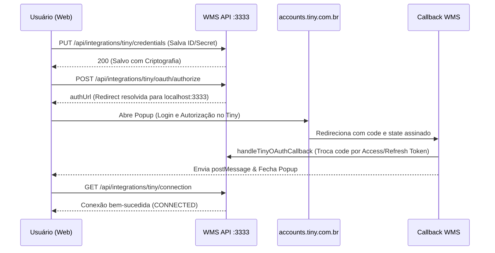

# 🔌 Conexão da Conta Tiny/Olist — Histórico e Ajustes

Este documento registra o histórico da integração OAuth com a **Olist ERP API v3** (Tiny). Ele descreve como estava o comportamento da API e do frontend antes das correções, os problemas encontrados e o que foi ajustado para que o fluxo funcione perfeitamente em ambiente de desenvolvimento local.

> [!NOTE]
> Para a referência técnica contínua (rate limits, refresh de tokens e criptografia), consulte o guia principal: [[integracao-tiny-oauth|Integração Tiny ERP (v3)]].

---

## 🗺️ Contexto do Protocolo

A integração utiliza o fluxo **OAuth 2.0 / OpenID Connect** do Tiny ERP:
*   **Documentação Oficial**: [Autenticação Tiny API v3](https://api-docs.erp.olist.com/documentacao/comecando/autenticacao)
*   **Endpoint de Login/Autorização**: `https://accounts.tiny.com.br/realms/tiny/protocol/openid-connect/auth`
*   **Redirect URI do WMS (Callback)**: `{API_PUBLIC_URL}/integrations/tiny/oauth/callback`
*   **Interface no Dashboard**: Acessível em `/integracoes/tiny`.

---

## ❌ Problemas Encontrados (Antes dos Ajustes)

Durante os testes locais de integração, o fluxo falhava em múltiplas etapas. Abaixo estão detalhadas as causas raiz e os comportamentos observados.

### 1. Bloqueio de CORS no Salvamento de Credenciais
> [!BUG] **Sintoma: Falha na requisição**
> A chamada `PUT /api/integrations/tiny/credentials` falhava no navegador com erro de rede ou política de CORS (*Failed to fetch*).
> 
> *   **Causa**: O CORS do backend (`apps/api/src/index.ts`) estava configurado para aceitar apenas os métodos `GET` e `POST`. Os verbos `PUT`, `PATCH` e `DELETE` eram bloqueados.

### 2. Permissão Negada (Erro 403) para Expedidores
> [!WARNING] **Sintoma: Tela de erro ou crash na UI**
> Ao tentar salvar as credenciais ou testar a conexão, o sistema retornava `{ "error": "Permissão negada" }`.
> 
> *   **Causa**: As rotas da API do Tiny exigiam a permissão `settings.manage`. No entanto, a tela no frontend exige apenas `olist.configure`. O usuário de teste padrão (`operador@wms.local`, papel `EXPEDITER`) tem permissão para configurar integrações, mas não para gerenciar configurações globais do sistema.

### 3. Botão "Conectar com Olist" Desabilitado
> [!BUG] **Sintoma: Impossibilidade de iniciar o OAuth**
> O botão para conectar permanecia cinza (desabilitado) mesmo com o Client ID e Client Secret preenchidos no formulário.
> 
> *   **Causa**: O estado do frontend condicionava a ativação do botão apenas quando a conexão já estivesse ativa (`connection.connected === true`), impossibilitando o primeiro login.

### 4. Falha de Body Vazio no Fastify 5 (Erro 400)
> [!BUG] **Sintoma: POST /oauth/authorize retornava Bad Request**
> A API do Fastify respondia com status 400: `Body cannot be empty when content-type is set to 'application/json'`.
> 
> *   **Causa**: O cliente de requisição do frontend (`apiFetch`) insere automaticamente o cabeçalho `Content-Type: application/json`. No entanto, a chamada de autorização não possuía dados no corpo (body nulo). O Fastify 5 rejeita requisições JSON vazias por padrão.

### 5. Redirecionamento Incorreto do Popup OAuth
> [!WARNING] **Sintoma: Mismatch ou login em tela errada**
> O popup de autorização redirecionava para a URL de produção (`app.visoratech.com.br`) ao invés do localhost em desenvolvimento.
> 
> *   **Causa**: O aplicativo configurado na Olist continha o Redirect URI de produção. No WMS, a tabela `tiny_connections` aceitava qualquer string inserida manualmente, gerando incompatibilidade de domínios (*mismatch*).

### 6. Crash no Worker de Refresh de Tokens (Prisma EPERM)
> [!BUG] **Sintoma: Crash na inicialização da API**
> O log exibia `[tiny-oauth-worker] Unknown argument isActive`.
> 
> *   **Causa**: Novas colunas foram inseridas no banco de dados, mas o Prisma Client não foi gerado novamente (`pnpm db:generate`). No Windows, o processo do dev server bloqueia as DLLs do Prisma, gerando erros de permissão (`EPERM`) se tentado gerar com o servidor rodando.

---

## 🛠️ Correções Aplicadas

### 💻 Infraestrutura e Scripts

*   **Monorepo (`package.json`)**: Ajustado o script `pnpm dev` para subir em paralelo a API e o painel Web de forma sincronizada.
*   **Seed Automático (`apps/api/package.json`)**: Adicionado o gatilho `preseed` para compilar o pacote `@wms/shared` antes de rodar os seeds, evitando erros de importação de tipos.
*   **Variáveis de Ambiente**: Mapeadas as variáveis críticas no arquivo `.env.example`.

### 🖧 Backend (Fastify & Prisma)

*   **Nova Permissão**: Criada a validação `requireOlistConfigure` usando a chave de permissão `olist.configure` para isolar rotas do Tiny.
*   **CORS**: Habilitada a aceitação dos métodos `PUT`, `PATCH` e `DELETE` no entrypoint da API.
*   **Normalização de Redirecionamento (`resolveOAuthRedirectUri`)**: Função que força a URI de redirect para o endereço público da API WMS atual, impedindo domínios incorretos salvos de produção.
*   **Parâmetro `prompt=login`**: Adicionado à URL de autorização para forçar a tela de seleção de conta do Tiny ERP.
*   **State Seguro**: O parâmetro `state` do OAuth passou a ser gerado de forma estruturada: `{nonce}:{userId}:{tenantId}:{connectionId}:{hmac}` e assinado via HMAC SHA-256 (`AUTH_SECRET`).

### 🖥️ Frontend (Next.js Dashboard)

*   **Fluxo de Salvamento**: A UI agora salva as credenciais de forma transparente antes de abrir o popup de autorização.
*   **Fastify Bypass**: Adicionado `{}` no corpo do POST de autorização para satisfazer a validação de JSON do Fastify 5.
*   **Somente Leitura**: O campo de Redirect URI no painel web foi alterado para apenas leitura, exibindo a URL exata gerada pela API para evitar erros de digitação.

---

## 🔄 Fluxo de Comunicação Corrigido



---

## 📋 Passo a Passo para Teste Local

Siga este roteiro para testar e validar o fluxo de ponta a ponta em sua máquina:

### 1. Preparar o Ambiente
Verifique as variáveis no arquivo `apps/api/.env`:
```env
API_PUBLIC_URL="http://localhost:3333"
WEB_URL="http://localhost:3000"
ENCRYPTION_KEY="sua_chave_hexadecimal_de_64_caracteres"
AUTH_SECRET="sua_chave_secreta_de_assinatura"
```

### 2. Inicializar o Banco
Pare o dev server e rode as atualizações de modelo:
```bash
pnpm db:push
pnpm db:generate
pnpm db:seed
pnpm dev
```

### 3. Cadastro no Tiny ERP
No painel do Tiny do cliente (em ambiente de teste ou sandbox), insira o Redirect URI exatamente como:
```
http://localhost:3333/integrations/tiny/oauth/callback
```

### 4. Conectar
1.  Faça login no painel web com o usuário `operador@wms.local` (senha `operador123`).
2.  Navegue até **Integrações → Tiny ERP**.
3.  Preencha as credenciais, clique em **Salvar** e depois em **Conectar com Olist**.
4.  Efetue o login no popup e conceda acesso. O status na tela deverá mudar para **Conectado**.

---

## 🔍 Resolução de Problemas Rápidos (Troubleshooting)

> [!TIP] **Erro 403 (Forbidden) ao acessar a página**
> Garanta que o usuário logado possui a permissão `olist.configure` vinculada ao seu papel.

> [!WARNING] **Erro de Mismatch no Redirect URI**
> Certifique-se de que a URI cadastrada no painel de aplicativos do Tiny ERP é idêntica à exibida como somente leitura na tela do WMS.

> [!CAUTION] **Perda de conexão após reiniciar a API**
> Ocorre se a variável `ENCRYPTION_KEY` estiver ausente ou mudar de valor entre reinicializações. O WMS não conseguirá decriptografar os tokens salvos anteriormente. Garanta uma chave fixa no arquivo `.env`.

---

## 🔗 Referências Úteis
*   [[integracao-tiny-oauth|Integração Tiny ERP (v3)]] — Detalhes da API v3 e controle de rate limits.
*   [[integracao-tiny-pedidos|Integração Tiny — Pedidos de venda]] — Sync pull, situação Aberta (0), filtro `origemPedido`, SKU (jun/2026).
*   [[setup-desenvolvimento|Guia de Setup Local]] — Variáveis de ambiente e Docker.
*   [[usuarios-teste|Credenciais e Testes]] — Contas e e-mails criados por padrão.
